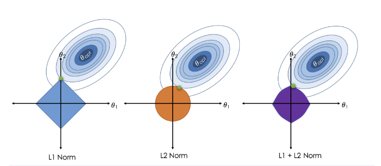

# File Introduction, Preamble and Setup {.unnumbered .tabset .tabset-fade .tabset-pills}

```{r setup, message = FALSE , warning = FALSE , include=FALSE}
knitr::opts_chunk$set(echo = TRUE , eval = TRUE)
```

<style>
    .ref {
        position: relative;
        vertical-align: baseline;
    }

    .refnum {
        position: relative;
        left: -1px;
        bottom: 1ex;
        font-family: Verdana, sans-serif;
        color: #005994;
        font-size: .7em;
        font-weight: bold;
        text-decoration: underline;
        cursor: pointer;        
    }

    .refbody {
        font-family: Verdana, sans-serif;
        font-size: .7em;
        line-height: 1.1;
        display: none;
        min-width: 20em;
        position: absolute;
        left: 25px;
        bottom: 5px ;
        border: 1px solid;
        padding: 5px;
        background-color: #fff;
        word-wrap: break-word;
        z-index: 9999;
        overflow: auto;
    }

</style>

<script>
    function footypop(id) {
        var el = document.getElementById(id) ;
  
        if (el.style.display == "none") {
            el.style.display = "block" ;
        } else {
            el.style.display = "none" ;
        }
        
    }
</script>

## It Came from the Deep (Darkness of My Dissertation) {.unnumbered}

This document is a slimmed-down version of one chapter of my dissertation<span class="ref"><span class="refnum" onclick="footypop('ref1')">[ref]</span><span id="ref1" class="refbody">@MattDiss</span></span>. The chapter outlines many more concepts and lasso/elastic net adaptations, but I have cut down the material to a review of the lasso, the elastic net, the three adaptations used in components being demonstrated in this page, and a handful mathematical clarifications. The sections that are included herein are largely lifted directly from my dissertation as they were originally written, with exception of deleted sections, formatting, and some revisions made to enhance the resulting document.

Due to the nature of the topics covered, this walkthrough is **Very Math Heavy**. I recommend this section only for those interested in technical details of the adaptations discussed in subsequent demonstrations or in the ensemble approach this repo proposes. Some familiarity with the mathematical formulation and expression of OLS regression will go a long way to supporting understanding of the following content.

## Formatting Notes {.unnumbered}

This document makes use of **bolding**, _italics_, and "quotations" to help distinguish references to different types of items.

 * **bolding** will be used when referencing a new term or concept for the first time. Subsequent references to each term/concept will _not_ be bolded.
 * _italics_ will be used primarily for emphasis.
 * 'single quotations' will be used to clarify specific arguments for a function, or specific parameters of a mathemtical/statistical formulation
 * Inline references to code (functions, objects, specific commands, etc.) will use **<span style = "color:blue">`` `r "code_chunk_formatting"` ``</span>** in **<span style = "color:blue">`` `r "bolded blue font"` ``</span>**
 * Inline references to packages will similarly use *<span style = "color:red">`` `r "code_chunk_formatting"` ``</span>*, except in *<span style = "color:red">`` `r "italicized red font"` ``</span>*
 * References to other documents in this repository will use <span style = "color:green">`` `r "code_chunk_formatting"` ``</span> in <span style = "color:green">`` `r "un-italicized, un-bolded, green font"` ``</span>
 
The most important aspects of how I use spacing and line breaks are detailed below.

I generally put spaces between code inputs I consider "sufficiently distinct". This improves readability generally, but I find it particularly helpful for debugging. Note, however, that spaces are generally trivial in between distinct code elements in R, although this is not universally the case. Multi-character code elements, such as the pointer **<span style = "color:blue">`` `r "<-"` ``</span>** and most logical operators, _cannot_ include spaces in between components of the element. Note also that whitespace *is* meaningful in other programming languages, and so this convention should be considered with caution in your own practice.

Generally, I use line breaks to:

 * Break up separate arguments for a single command/function or chain of operations
 * To clearly distinguish between different closing parentheses, brackets, squigglies, etc., since RStudio will automatically tab each closing piece to align with its opening segment.

## Notes on Mathematical Formatting {.unnumbered}

Generally, an unbolded symbol (typically a letter or Greek letter) represents a singular value, while a **bolded** symbol represents a vector or piece information composed of multiple values. Some examples below:

 * $\boldsymbol{y}$ or $\boldsymbol{\beta}$ are bolded because they are vectors of response values and coefficients, respectively
   * $y_i$ or $\beta_j$ are _not_ bolded because they correspond with the $i$-th observation's response value or the $j$-th potential predictor's coefficient value.
 * $\boldsymbol{X}$ and its components are generally all bolded, as they represent a collection of predictor values for each unit of observation
   * $\boldsymbol{x}_i$, then, represents a vector of _all_ predictor values for observation $i$

## A Note on Mathematical Norms {.unnumbered}

The descriptions provided below are simplified descriptions provided for practical clarity. They do not represent the complete formal definitions of norms more generally, nor of specific norms mentioned. Mathematical norms measure a "distance" of sorts between points along a vector, typically represented symbolically by $\ell_q$ or $\ell_p$. As a representation of abstracted distance, this value is always nonnegative. Given the use of $p$ in the current research to indicate the number of potential predictors from which a method selects model variables, $\ell_q$ represents the generalized norm throughout this research. Mathematically, the $\ell_q$-norm is:


\begin{equation}
     \parallel\cdot\parallel_q = \big( \sum_{i=1}^{n} \left|\cdot_i\right|^q \big)^{1/q}
\end{equation}


for some real number $q \geq 1$, where $\cdot$ represents a vector of length $n$. The $\ell_2$-norm represents the straight distance between points on a vector, while the $\ell_1$-norm represents the absolute magnitude of the path between points on a vector. Both of these norms occur frequently in the current context. The $\ell_2$-norm of the vector of residuals is used both as the primary minimizing criteria for OLS regression and the coefficient penalizer in ridge regression. Meanwhile, the $\ell_1$-norm penalizes coefficients in the lasso and also replaces the $\ell_2$-norm used in standard OLS regression for LAD-loss regression.

$\ell_q$ for $q \ge 2$ represent distance notions with less-clear practical examples. and are not used herein, and are thus not addressed further. Complex norms with $g < 1$ also exist, but are similarly left to external research for those interested.

# Introduction {.tabset .tabset-fade .tabset-pills}

## General Introduction

This chapter reviews the lasso, elastic net, and relevant adaptations made to these techniques to improve their variable selection performance in different scenarios.

The Least Absolute Shrinkage and Selection Operator (lasso) was first proposed by @Tibshirani1996 to address limitations in the standard Ordinary Least Squares regression framework. Extreme variance in the prediction of the Ordinary Least Squares (OLS) estimates and reduced interpretability given large numbers of predictors underlie this initial proposal. The two contemporary solutions to these problems, ridge regression and subset selection, each suffered from drawbacks. Subset selection provided highly interpretable results. However, as a result of the discrete selection process, subset selection suffered from extreme variance. This extreme variance produced especially non-robust selections, as relatively minute changes in the modeled data could select vastly different variables. Consequently, prediction accuracy also suffered. Ridge regression, meanwhile, proved much more effective in producing stable and consistently strong predictions from its models. Unfortunately, ridge regression never estimates any coefficients to 0, and thus models are not easily interpreted.

## The Lasso: Least Absolute Shrinkage and Selection Operator

Enter the lasso, intended to produce a model with the stability and prediction capability of ridge regression and the interpretability of subset selection. Consider first the standard linear regression model with $p$ predictors:

\begin{align}
     y_i = \beta_0 + \boldsymbol{x}_i\sum_{j=1}^{p}\beta_j,
\end{align}

where $y_i$ represents an outcome value for subject $i, i - 1,...,n$, $\beta_0$ is some intercept or group average for the outcome vector $\boldsymbol{y}$, $\boldsymbol{x}_i$ is a $p$-length vector of values for subject $i$ for all possible predictors, and $\beta_j$ is the coefficient estimate corresponding with the $j$th predictor, $j = {1,...,p}$. The standard solution to the linear regression problem is to estimate coefficients $\beta_j$ using least-squares, which attempts to minimize the following objective function:

\begin{align}
     OLS = \operatorname*{arg\,min}_{\beta_0,\beta\in{R}^p} \bigg\{ \frac{1}{2n}
    \parallel\textbf{y}-\beta_0\textbf{1}-\textbf{X}\boldsymbol{\beta}\parallel_2^2 \bigg\} ,
\end{align}

where $\textbf{y}$ is the vector of responses, $\textbf{1}$ is an $n$-length vector of all 1's, $\textbf{X}$ is an $n \times p$ matrix containing vectors $\boldsymbol{x}_i$, and $\parallel\cdot\parallel_2$ is the squared-error loss function, otherwise known as the Euclidian or $\ell_2$ norm. Further details on these norms can be found below. The general purpose of this technique is to determine a line that passes as close as possible to all observations, doing so by minimizing the square of the difference between the model-predicted value and the observed outcome $y_i$ (in other words, the residual sum of squares).

Regularization (which includes ridge and the lasso) operates in this context by adding an additional term to the OLS objective function that constrains coefficient estimates based on a particular criterion. The OLS formula above then becomes the following in the case of the lasso: 

\begin{align}
     lasso = \operatorname*{arg\,min}_{\beta\in{R}^p} \bigg\{ \frac{1}{2n}
    \parallel\textbf{y}-\beta_0\textbf{1}-\textbf{X}\boldsymbol{\beta}\parallel_2^2 \bigg\} \notag\\
    \text{subject to} \parallel{\boldsymbol{\beta}}\parallel_1\leq\textit{t},
\end{align}

where $\parallel\boldsymbol{\beta}\parallel_1 \leq \textit{t}$ represents the $\ell_1$-norm constraint, 't' a constant chosen to induce variable shrinkage, and the equation to be minimized the standard least-squares minimization problem as described in above. The constant 't' bounds the parameter estimates of the resulting model by limiting the sum of the absolute values of these estimates, constraining the model by shrinking parameter estimates and reducing some coefficients completely to zero. This constraint, and its isomorphic equivalent $\lambda$, is typically chosen using an external, data-driven technique such as cross-validation. The $\ell_1$-norm, alternatively known as the Least Absolute Deviation, minimizes the absolute value of the difference between an observed value and the corresponding value predicted by the model, and compares to the $\ell_2$-norm described previously. Alternately expressed in Lagrangian form,

\begin{align}
     lasso = \operatorname*{arg\,min}_{\beta\in{R}^p} \bigg\{ \frac{1}{2n} \parallel{\textbf{y}-\textbf{X}\boldsymbol{\beta}}\parallel_2^2 + \lambda\parallel{\boldsymbol{\beta}}\parallel_1 \bigg\}
\end{align}

for some $\lambda\geq 0$, where $\lambda$ represents a tuning hyperparameter with a direct relationship to 't' under the constraint $\parallel\boldsymbol{\beta}\parallel_1\leq\textit{t}$.

For convenience with later adaptations, another formulation of the lasso criterion is as follows<span class="ref"><span class="refnum" onclick="footypop('ref2')">[ref]</span><span id="ref2" class="refbody">see @Tibshirani1996, @Wangetal2007</span></span>:

\begin{align}
     lasso = \operatorname*{arg\,min}_{\boldsymbol{\beta}\in{R}^p} \sum_{i=1}^{n} (y_i-\boldsymbol{x_i^\prime}\boldsymbol{\beta})^2 + n\lambda\sum_{j=1}^{p}\left|\beta_j\right|
\end{align}

The first term on the right-hand side of the equation represents the least-squares criterion (i.e., the $\ell_2$-norm from before), and the second represents the $\ell_1$-norm lasso constraint in relation to sample size, 'n'. Ridge regression follows a similar form as the lasso. Ridge uses the $\ell_2$-norm constraint, $n\lambda\sum_{j=1}^{p}(\beta_j)^2$, instead of the $\ell_1$-norm constraint. \par


## The Elastic Net

In their preliminary paper on the elastic net, @ZouHastie2005 described three major issues with the general lasso:

 * When $p > n$, the lasso can only select up to $p$ variables.
 * Given correlated variables or groups of variables, the lasso will arbitrarily select one into the model and eliminate the others.
 * Even in $n > p$ data, given sufficient predictor correlations, lasso's prediction performance is poor relative to other methods like ridge regression.

To address these concerns, @ZouHastie2005 propose the naïve elastic net, which utilizes both $\ell_1$- and $\ell_2$-norm regularization:

\begin{equation}
     NaiveENet = 
     \operatorname*{arg\,min}_{\boldsymbol{\beta}\in{R}^p}\sum_{i=1}^{n} (y_i-\boldsymbol{x_i^\prime}\boldsymbol{\beta})^2 + (\alpha)\lambda_1\sum_{j=1}^{p}\left|\beta_j\right| + (1-\alpha)\lambda_2\sum_{j=1}^{p}(\beta_j)^2
\end{equation}

where $\lambda_{1}$ is the same lasso tuning hyperparameter outlined previously, $\lambda_2$ is the corresponding tuning hyperparameter for $\ell_2$ shrinkage, and $0 \leq \alpha \leq 1$ is a hyperparameter that controls each regularization terms' contributions to model estimation and variable shrinkage. Note that when $\alpha = 0$, this reduces to ridge regression. Similarly, this reduces to the lasso when $\alpha = 1$. $\alpha = 0.5$ corresponds with equal contributions from both ridge and lasso regularization.

Although this initial method addressed the first and second concerns about the lasso, @ZouHastie2005 noted unsatisfactory predictive performance in most cases in the third scenario. The authors, therefore, propose a corrected version, known now as the elastic net: 

\begin{equation}
     ENet = 
     (1-\frac{\lambda_2}{n})\{
     \operatorname*{arg\,min}_{\boldsymbol{\beta}\in{R}^p}\sum_{i=1}^{n} (y_i-\boldsymbol{x_i^\prime}\boldsymbol{\beta})^2 + (\alpha)\lambda_1\sum_{j=1}^{p}\left|\beta_j\right| + (1-\alpha)\lambda_2\sum_{j=1}^{p}(\beta_j)^2
     \}
\end{equation}

The main difference between the naive and modern elastic net formulations lies in the correction term $(1 - \frac{\lambda_2}{n})$ before the rest of the objective function. The authors demonstrate the superior performance of the elastic net over the lasso and ridge regression on the three lasso concerns, with both real and simulated data.

A simplified visualization of the three regularization methods mentioned so far can help illustrate the mechanical process by which they operate. **Figure 1**<span class="ref"><span class="refnum" onclick="footypop('ref3')">[ref]</span><span id="ref3" class="refbody">@ZouHastie2005</span></span>below displays the optimized solution region $\theta_{opt}$, where $\theta$ represents the parameter space for predictors $\boldsymbol{\beta}$. for two predictors determined by some arbitrary regression estimator, and the constraints placed on those regions by the $\ell_1$-norm constraint (the lasso), the $\ell_2$-norm constraint (ridge regression), and combined $\ell_1$- and $\ell_2$-norm constraint (elastic net regression), respectively. The lasso's penalty results in potentially optimal values at vertices of the constraint surface - in other words, at a point corresponding with one of the coefficient estimates set to 0. 




Meanwhile, the $\ell_2$-norm constraint in ridge regression is perfectly circular, with all points on the constraint surface equally optimal. Although in practice there exists a minimal possibility that ridge might estimate a coefficient to 0 on this surface, the theoretical probability is 0 due to the continuous nature of the constraint surface. 

Finally, the elastic net constraint surface features vertices at 0-estimates \textit{and} a curvilinear surface in between these vertices. As balancing hyperparameter $\alpha$ increases from 0 to 1, the constraint surface shifts from a perfectly circular region to a perfectly square region. Not quite so evident from these plots, however, is the added benefit of selecting most or all correlated predictors into or out of the model, compared to the lasso's tendency to arbitrarily select one of a correlated group of variables and eliminating the rest of the group<span class="ref"><span class="refnum" onclick="footypop('ref4')">[ref]</span><span id="ref4" class="refbody">see @ZouHastie2005</span></span>.

All subsequent formulations will use $\lambda_{1}$ to represent the lasso tuning hyperparameter and $\lambda_2$ to represent the ridge hyperparameter. Other tuning hyperparameters will be formulated and defined as necessary.


# Review of Relevant Adaptations to the Lasso and Elastic Net {.tabset .tabset-fade .tabset-pills}

## Adaptive Tuning Hyperparameter

One of the first proposed modifications of the lasso uses adaptive tuning hyperparameters $\lambda_{1,j}$<span class="ref"><span class="refnum" onclick="footypop('ref5')">[ref]</span><span id="ref5" class="refbody">@Zou2006</span></span>. The adaptive lasso, or weighted lasso, replaces the single tuning hyperparameter $\lambda_{1}$ with a weighted combination of variable-specific tuning hyperparameters. In layman's terms, the adaptive tuning parameters differentially shrinks each variable. This modification primarily attempts to address problems of inconsistent variable selection that arise from finding the optimal tuning hyperparameter $\lambda_{1}$ for best prediction<span class="ref"><span class="refnum" onclick="footypop('ref6')">[ref]</span><span id="ref6" class="refbody">see @FanLi2001; @MeinshausenBuhlman2004</span></span>:


\begin{equation}
     AdLasso = \operatorname*{arg\,min}_{\boldsymbol{\beta}\in{R}^p}\sum_{i=1}^{n} (y_i-\boldsymbol{x_i^\prime}\boldsymbol{\beta})^2 + \lambda_{1,j}\sum_{j=1}^{p}\boldsymbol{\hat{w}}\left|\beta_j\right|,
\end{equation}


where $\boldsymbol{\hat{w}} = 1/\left|\hat{\boldsymbol{\beta}}\right|^\gamma$ is a vector of coefficient weights for some weighting hyperparameter $\gamma > 0$ and for some root-n consistent estimator of $\boldsymbol{\beta}$, $\hat{\boldsymbol{\beta}}$. The initial coefficient estimates $\hat{\boldsymbol{\beta}}$ are estimated in a preliminary regression model. The choice of estimator $\hat{\boldsymbol{\beta}}$ is relatively arbitrary, and no convention exists in the literature. For consistency with previous research, ridge regression provides the preliminary coefficient estimates $\hat{\boldsymbol{\beta}}$. Typically, $\gamma$ is chosen via cross-validation in a fashion similar to the selection of $\lambda_{1}$.  

@ZouZhang2009 made a similar adaptation to the elastic net due to similar concerns with the lasso tuning hyperparameter, as well as concerns of the combined impacts of collinearity and dimensionality on model selection and estimation.

\begin{equation}
     AdENet = (1+\frac{\lambda_2}{n})\{
     \operatorname*{arg\,min}_{\boldsymbol{\beta}\in{R}^p}\sum_{i=1}^{n} (y_i-\boldsymbol{x_i^\prime}\boldsymbol{\beta})^2 + (\alpha)\lambda_{1,j}\sum_{j=1}^{p}\hat{w}_j\left|\beta_j\right| + (1-\alpha)\lambda_2\sum_{j=1}^{p}(\beta_j)^2
     \},
\end{equation}

Note in the elastic net formulation that only the lasso penalty term incorporates the adaptive tuning hyperparameter.

## Multi-Step Adaptive Elastic Net

@XiaoXu2015 propose that three fundamental issues arise when using the standard lasso penalty: 

 * Coefficient estimates are biased
 * Multicollinearity results in the selection of only one predictor among a group of correlated predictors
 * Excessive false-positives when selecting true zero coefficients into the final model which generally contains the true non-zero coefficients
 
Given that the adaptive tuning hyperparameter addresses the first concern and the ridge penalty in the elastic net deals with the second, the authors suggest the use of a multi-step estimation procedure for handling the third. This procedure relies on the notion that the model estimated by adaptive lasso and elastic net penalties generally succeeds at selecting true non-zero coefficients but includes too many true zero coefficients in the model with only a single estimation step.

The multi-step adaptive elastic net is conducted as follows:
 
 * Initialize adaptive weights $\boldsymbol{\hat{w}}$ using the estimator of choice, $\hat{\boldsymbol{\beta}}$.
 * For $\textit{k} = 1,2,...,\textit{M}$, solve the elastic net problem
    \begin{equation}
        (1+\frac{\lambda_2}{n})\{
        \operatorname*{arg\,min}_{\boldsymbol{\beta}\in{R}^p}\sum_{i=1}^{n} (y_i-\boldsymbol{x_i^\prime}\boldsymbol{\beta})^2 + (\alpha)\lambda_{1,j}^{*(k)}\sum_{j=1}^{p}\hat{w}_j^{(k-1)}\left|\beta_j\right| + (1-\alpha)\lambda_2^{*(k)}\sum_{j=1}^{p}(\beta_j)^2
        \}
    \end{equation}
    where $\lambda_1^{*(k)}$ and $\lambda_2^{*(k)}$ represent the optimized tuning hyperparameters at the current stage, and $\hat{w}_j^{(k-1)}$ the weights for the lasso tuning hyperparameter determined at the previous step.


Note that the parenthetical superscripts $^{(k)}$ and $^{(k-1)}$ a represent indices rather than exponents for the tuning hyperparameter and tuning hyperparameter weight, respectively. $k$ in this process represents the number of elastic net estimation stages. Running the procedure with $k = 1$ stage amounts to the standard elastic net (since there can be no 0th set of weights), and with $k = 2$ stages, the result is the previously described adaptive elastic net. $k > 2$ results in the multi-step adaptive process as proposed by @XiaoXu2015. The authors do not clearly state how many steps they used for their multi-step procedure, a concern discussed in multiple subsequent chapters.


## Least Absolute Deviation (LAD) Loss Function

@Wangetal2007 proposed one of the earliest attempts at robustifying the lasso to response outliers. They propose replacing the least squares criterion with the least absolute deviation (LAD), i.e. the $\ell_1$-norm:


\begin{equation}
     LADLasso = \operatorname*{arg\,min}_{\boldsymbol{\beta}\in{R}^p}\sum_{i=1}^{n} \left|y_i-\boldsymbol{x_i^\prime}\boldsymbol{\beta}\right| + \lambda_{1,j}\sum_{j=1}^{p}\hat{w}_j\left|\beta_j\right|,
\end{equation}


where $\left|y_i-\boldsymbol{x_i^\prime}\boldsymbol{\beta}\right|$, the LAD-loss function (aka the $\ell_1$-norm), replaces the typical least-squares loss function. This loss function therefore penalizes the absolute value of residuals rather than the square. Due to the timing of their study, @Wangetal2007 do not explicitly make use of the findings and techniques from @Zou2006. However, their LAD-lasso technique also uses an adaptive tuning hyperparameter $\lambda_{1,j}$ and coefficient weights vector $\hat{w}_j$. $\lambda_{1,j}$ and $\hat{w}_j = 1/\left|\hat{\beta}\right|^\gamma$ are as defined previously in **Section 2.1**. This method shall hereafter be referred to as "adaptive LAD lasso."

The LAD elastic net has not yet been studied in the literature and exists primarily due to related software implementation developed by @YiHuang2017. Via the *<span style = "color:red">`` `r "hqreg"` ``</span>* package from @hqreg, it is possible to simultaneously utilize the LAD loss with lasso regularization. Consequently, the package provides implementation for the elastic net with the LAD loss function. As with the lasso formulation, LAD elastic net incorporates the adaptive lasso tuning hyperparameter. The LAD elastic net formulation is as follows:


\begin{equation}
     LADENet =
     (1+\frac{\lambda_2}{n})\{
     \operatorname*{arg\,min}_{\boldsymbol{\beta}\in{R}^p}\sum_{i=1}^{n} \left|y_i-\boldsymbol{x_i^\prime}\boldsymbol{\beta}\right| + (\alpha)\lambda_{1,j}\sum_{j=1}^{p}\hat{w}_j\left|\beta_j\right| + (1-\alpha)\lambda_2\sum_{j=1}^{p}(\beta_j)^2
     \}
\end{equation}


## Huber Loss Function

Looking towards older work in robust estimation, @RossetZhu2007 and @LambertLacroixZwald2011 adapted the lasso by using the Huber loss function<span class="ref"><span class="refnum" onclick="footypop('ref7')">[ref]</span><span id="ref7" class="refbody">see @Huber1964MEsts</span></span> rather than the squared-error loss:


\begin{equation}
     HuberLasso = \operatorname*{arg\,min}_{\boldsymbol{\beta}\in{R}^p}\sum_{i=1}^{n} \textit{L}(y_i-\boldsymbol{x_i^\prime}\boldsymbol{\beta}) + \lambda_{1,j}\sum_{j=1}^{p}\hat{w}_j\left|\beta_j\right|,
\end{equation}

where $\textit{L}(\textit{z})$ is the Huber loss function:

\begin{equation}
    \textit{L}(z) = 
      \begin{cases} 
        z^2 & \left|z\right|\leq M,\\
        2M\left|z\right|-M^2 & \left|z\right|> M
     \end{cases},
\end{equation}

and $M$ is a transition hyperparameter that adjusts the value represented by $z$. $z$ can be any value; in the current setting, $z$ corresponds with the regression residuals $(y_i-\boldsymbol{x_i^\prime}\boldsymbol{\beta})$. 

@Huber1964MEsts and @Huber1981 originally developed the Huber estimator to enhance the robustness of regression methods and measures of central tendency. \textit{M} will be fixed to 1.345 based on empirical results by @Huber1981 that demonstrated this transition's balance of robustness as well as efficiency under normality. However, as @Zhengetal2016 noted, further work on transition hyperparameter selection for the Huberized lasso should be conducted.

Independently of @RossetZhu2007's and @LambertLacroixZwald2011's work incorporating Huber loss into the lasso, @YiHuang2017 outlined a Huberized elastic net:


\begin{equation}
     HuberENet = (1+\frac{\lambda_2}{n})\{
     \operatorname*{arg\,min}_{\boldsymbol{\beta}\in{R}^p}\sum_{i=1}^{n} \textit{L}(y_i-\boldsymbol{x_i^\prime}\boldsymbol{\beta}) + (\alpha)\lambda_1\sum_{j=1}^{p}\hat{w}_j\left|\beta_j\right| + (1-\alpha)\lambda_2\sum_{j=1}^{p}(\beta_j)^2.
     \}
\end{equation}


Their work coincided with the development of the *<span style = "color:red">`` `r "hqreg"` ``</span>* package for handling high-dimensionality data efficiently using an innovative Semismooth Newton Coordinate Descent Algorithm<span class="ref"><span class="refnum" onclick="footypop('ref8')">[ref]</span><span id="ref8" class="refbody">see @hqreg for more details</span></span>. Theoretical considerations of the algorithm fall outside the scope of the current applied statistical research; interested readers should consider their original paper for further details. @YiHuang2017's simulations focus solely on the run-time of their SNCD-based methods compared to similar methods and not on performance metrics.

The Huberized lasso and elastic net both incorporate the adaptive tuning hyperparameter in the current study. They will therefore be referred to as "adaptive Huberized lasso" or "adaptive Huber lasso" and "adaptive Huberized elastic net" or "adaptive Huber elastic net." Some studies implement a non-adaptive version of the Huber lasso or elastic net, and those will be referred to simply as "Huber lasso" or "Huber elastic net."


# Model Implementation in R {.tabset .tabset-fade .tabset-pills}

## Included Models and Software Implementation

The current simulations evaluate the variable selection abilities of the following methods. The next section includes further details about cross-validation procedures that are non-specific to method or implementation.

 * **Multi-Step Adaptive Elastic Net**: The multi-step adaptive elastic net was conducted using the **<span style = "color:blue">`` `r "msaenet()"` ``</span>** function from the *<span style = "color:red">`` `r "msaenet"` ``</span>* package<span class="ref"><span class="refnum" onclick="footypop('ref9')">[ref]</span><span id="ref9" class="refbody">@msaenet</span></span>. This function includes a built-in procedure for calculating initial coefficient estimates $\boldsymbol{\hat{\beta}}$ for subsequent weighting during the adaptive lasso process. The initial ridge estimates and subsequent weight application were thus all implemented within this function rather than through running a preliminary model, although cross-validation still needed to be incorporated for selecting optimal values for the weighting hyperparameter $\gamma$. The original study does not outline the number of stages used in their simulations, nor a recommended number of stages. Therefore, the number of stages $k$ was arbitrarily set to 3, 5, and 10. 
  * **Adaptive LAD Lasso and Elastic Net**: The adaptive LAD lasso and elastic net were implemented using the **<span style = "color:blue">`` `r "cv.hqreg()"` ``</span>** function from the *<span style = "color:red">`` `r "hqreg"` ``</span>* package<span class="ref"><span class="refnum" onclick="footypop('ref10')">[ref]</span><span id="ref10" class="refbody">@hqreg</span></span> by setting the 'method' argument to "quantile" and the corresponding hyperparameter 'tau' argument to 0.5 for the LAD lasso criterion. This function includes a similar "penalty.factor" argument to **<span style = "color:blue">`` `r "cv.glmnet()"` ``</span>**, which was used to apply weights during the adaptive lasso process. An additional cross-validation procedure needed to be incorporated to determine optimal weighting hyperparameter $\gamma$. A variable screening procedure for computational optimization developed by @Tibshiranietal2012 was incorporated into the function by setting the 'screen' argument to "SR." The authors also developed a new, less computationally-intensive screening rule, which is less conservative as a result and can be found detailed in their study. The original, more conservative screening rule developed by @Tibshiranietal2012 was chosen for this study. Although the choice to use a screening rule (as opposed to none) was made at the recommendation of the developers of the *<span style = "color:red">`` `r "hqreg"` ``</span>* package, the choice of particular rule was arbitrary on my part given the lack of specific recommendations.
  * **Adaptive Huberized Lasso and Elastic Net**: The adaptive Huberized lasso and elastic net were implemented using the **<span style = "color:blue">`` `r "cv.hqreg()"` ``</span>** function from the *<span style = "color:red">`` `r "hqreg"` ``</span>* package<span class="ref"><span class="refnum" onclick="footypop('ref11')">[ref]</span><span id="ref11" class="refbody">@hqreg</span></span> by setting the 'method' argument to "huber" and the corresponding transition hyperparameter 'gamma' argument to 1.345 to balance both robustness of the Huber loss as well as efficiency under ideal data conditions, per recommendations by @Huber1981. The 'penalty.factor' argument was again used to apply weights during the adaptive lasso process. An additional cross-validation procedure needed to be incorporated to determine optimal weighting hyperparameter $\gamma$. The same screening rule was used as described in the adaptive LAD lasso and elastic net.
  


## Hyperparameter Selection and Cross-Validation Procedures

For all instances of the elastic net, balancing hyperparameter $\alpha$ was set to 0.5. In the course of my dissertation, values of 0.75 and 0.9 were also considered, but discarded due to lack of meaningful differences on primary performance metrics in initial simulations

It is standard to select tuning hyperparameters $\lambda$ via a cross-validation procedure rather than running models such as the lasso or ridge regression using a pre-determined value. No standard exists for the cross-validation procedure itself, so these simulations use the following procedure. Regularization tuning hyperparameters $\lambda$ were chosen from 100 logarithmically-equidistant values between 0.01 and 1400 by 5-fold cross-validation. NOTE: Multiple studies cite @LambertLacroixZwald2011 as the original source for this recommendation. @LambertLacroixZwald2011 does not, however, provide a rationale for this choice.

When utilizing the adaptive lasso tuning hyperparameter, a preliminary 5-fold cross-validated ridge regression was conducted using the same 100 lambda values and the resulting coefficients used for determining the weights vector. Unless otherwise specified, the initial ridge step was performed using the cv.glmnet function in the *<span style = "color:red">`` `r "glmnet"` ``</span>* package, @glmnet. This initial step was conducted internally for the multi-step adaptive elastic net, although arguments were specified to implement the same procedure and using the same sequence of potential $\lambda_2$ values. 

A subsequent 5-fold cross-validation procedure was conducted over 100 potential values of scaling hyperparameter $\gamma$ chosen from the logarithmic sequence described previous. The literature does not provide a standard selection procedure for this hyperparameter. Furthermore, the literature does not make any recommendations for the sequence of potential values to use in cross-validation.

The criterion for selection of optimal hyperparameters was mean prediction error in cross-validation test sets. NOTE: This is different from the test sets used to generate Mean Squared Error and which were indexed by the custom k-fold subsetting functions I demonstrate in <a href="https://multach87.github.io/Robust_Lasso_ElasticNet/Component_Demos/02A_KFold_Subsetter.html"><span style = "color:green">`` `r "02A_KFold_Subsetter"` ``</span></a> and <a href="https://multach87.github.io/Robust_Lasso_ElasticNet/Component_Demos/02B_KFold_Multi.html"><span style = "color:green">`` `r "02B_KFold_Multi"` ``</span></a>.


# References
