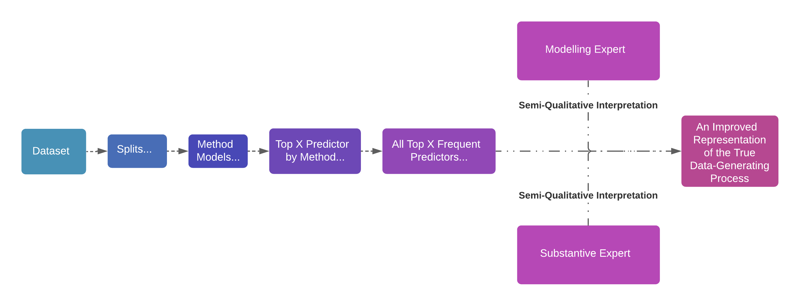

# Introduction, Preamble, and Setup {.unnumbered .tabset .tabset-fade .tabset-pills}

```{r setup, message = FALSE , warning = FALSE , include=FALSE}
knitr::opts_chunk$set(echo = TRUE , eval = TRUE)
```

<style>
    .ref {
        position: relative;
        vertical-align: baseline;
    }

    .refnum {
        position: relative;
        left: -1px;
        bottom: 1ex;
        font-family: Verdana, sans-serif;
        color: #005994;
        font-size: .7em;
        font-weight: bold;
        text-decoration: underline;
        cursor: pointer;        
    }

    .refbody {
        font-family: Verdana, sans-serif;
        font-size: .7em;
        line-height: 1.1;
        display: none;
        min-width: 20em;
        position: absolute;
        left: 25px;
        bottom: 5px ;
        border: 1px solid;
        padding: 5px;
        background-color: #fff;
        word-wrap: break-word;
        z-index: 9999;
        overflow: auto;
    }

</style>

<script>
    function footypop(id) {
        var el = document.getElementById(id) ;
  
        if (el.style.display == "none") {
            el.style.display = "block" ;
        } else {
            el.style.display = "none" ;
        }
        
    }
</script>

## Introduction {.unnumbered}

The goal of this walkthrough is to demonstrate an ensemble lasso/elastic net modeling approach proposed in the applied chapter of my dissertation<span class="ref"><span class="refnum" onclick="footypop('ref1')">[ref]</span><span id="ref1" class="refbody">@MattDiss</span></span>. Over the course of my dissertation, I showed that with non-collinear data, no one lasso or elastic net adaptation dominates others outlier- and skew-/kurtosis-related scenarios<span class="ref"><span class="refnum" onclick="footypop('ref1')">[1]</span><span id="ref1" class="refbody">reminding us that there is no free lunch in statistics</span></span>. Some adaptations, like the **multi-step adaptive elastic net**<span class="ref"><span class="refnum" onclick="footypop('ref2')">[ref]</span><span id="ref2" class="refbody">@XiaoXu2015</span></span>, perform incredibly well at eliminating variables which were not true predictors of the outcome, even in the presence of extreme outlier contamination. This strong elimination performance unfortunately coincided with a greater tendency to remove true predictors from the model. 

Other methods performed well in the opposite direction, including the **adaptive LAD lasso**<span class="ref"><span class="refnum" onclick="footypop('ref3')">[ref]</span><span id="ref3" class="refbody">@Wangetal2007</span></span>; the **adaptive LAD elastic net**<span class="ref"><span class="refnum" onclick="footypop('ref4')">[ref]</span><span id="ref4" class="refbody">currently un-proposed but possible thanks to @YiHuang2017 and @hqreg</span></span>; the **adaptive Huber lasso**<span class="ref"><span class="refnum" onclick="footypop('ref5')">[ref]</span><span id="ref5" class="refbody">@RossetZhu2007 and  @LambertLacroixZwald2011</span></span>; and the **adaptive Huber elastic net**<span class="ref"><span class="refnum" onclick="footypop('ref6')">[ref]</span><span id="ref6" class="refbody">@YiHuang2017</span></span>. These adaptations demonstrated consistently competitive performance in proper inclusion of true predictors and exclusion of non-predictors from the model. However, these adaptations typically did not show superior performance across scenarios relative to other adaptations for any given data condition.

Given these various results, I proposed an ensemble approach to leverage the advantages of each adaptation while smoothing out their respective disadvantages. Semi-qualitative interpretation of the results permits us better insight into the true predictors of an unknown process by incorporating known empirical characteristics of each adaptation. 

This document provides a full demonstration of this ensemble approach for improving the variable selection accuracy of lasso and elastic net adaptations. The walkthrough puts together the separate components demonstrated throughout the files in the <span style = "color:green">`` `r "Component Demonstrations"` ``</span> into a cohesive modeling machine.


## Formatting Notes {.unnumbered}

This document makes use of **bolding**, _italics_, and "quotations" to help distinguish references to different types of items.

 * **bolding** will be used when referencing a new term or concept for the first time. Subsequent references to each term/concept will _not_ be bolded.
 * _italics_ will be used primarily for emphasis.
 * 'single quotations' will be used to clarify specific arguments for a function, or specific parameters of a mathemtical/statistical formulation
 * Inline references to code (functions, objects, specific commands, etc.) will use **<span style = "color:blue">`` `r "code_chunk_formatting"` ``</span>** in **<span style = "color:blue">`` `r "bolded blue font"` ``</span>**
 * Inline references to packages will similarly use *<span style = "color:red">`` `r "code_chunk_formatting"` ``</span>*, except in *<span style = "color:red">`` `r "italicized red font"` ``</span>*
 * References to other documents in this repository will use <span style = "color:green">`` `r "code_chunk_formatting"` ``</span> in <span style = "color:green">`` `r "un-italicized, un-bolded, green font"` ``</span>
 
The most important aspects of how I use spacing and line breaks are detailed below.

I generally put spaces between code inputs I consider "sufficiently distinct". This improves readability generally, but I find it particularly helpful for debugging. Note, however, that spaces are generally trivial in between distinct code elements in R, although this is not universally the case. Multi-character code elements, such as the pointer **<span style = "color:blue">`` `r "<-"` ``</span>** and most logical operators, _cannot_ include spaces in between components of the element. Note also that whitespace *is* meaningful in other programming languages, and so this convention should be considered with caution in your own practice.

Generally, I use line breaks to:

 * Break up separate arguments for a single command/function or chain of operations
 * To clearly distinguish between different closing parentheses, brackets, squigglies, etc., since RStudio will automatically tab each closing piece to align with its opening segment.


## Packages {.unnumbered}

Let's load the necessary packages. Links to more information about each package can be found in <a href="https://multach87.github.io/Robust_Lasso_ElasticNet/Component_Demos/00C_Robust_Issues.html"><span style = "color:green">`` `r "00B_Package_Descr_Refs"` ``</span></a>. Appropriate references for each package can be found in the "References" section at the end of this document.

```{r libraries , warning = FALSE , message = FALSE}
# This chunk loads the packages used in this workbook
library(xaringan)   # Allows active preview of report in RStudio
library(mvtnorm)    # Generates multivariate-normal data
library(magrittr)   # Used for piping
library(purrr)      # Used for mapping functions efficiently
library(data.table) # For more streamlined data structures
library(glmnet)     # For general lasso/elastic net functionality
library(hqreg)      # For LAD/Huber-loss regularization with SNCD algorithm
library(rlang)      # For parse_expr() to parse data name in k-fold subsetting functions
library(msaenet)      # For the multi-step adaptive elastic net
library(gridExtra)    # For displaying grids of objects
library(grid)         # For creating a title for multiplot grid
library(ggplot2)      # For generating and manipulation graphical objects
```

---
nocite: |
  @magrittr , @purrr , @xaringan , @data.table , @glmnet , @hqreg , @rlang , @msaenet , 
  @gridExtra , @grid , @ggplot2 , @magrittr
---

If you do not have any of the listed packages, you should install them using **<span style = "color:blue">`` `r "install.packages(\"pkg-name-in-quotes-here\")"` ``</span>**.


# Data Generation {.tabset .tabset-fade .tabset-pills}

## Section Intro {.unnumbered}

To help demonstrate the combined approach in its entirety, I need a dataset to analyze. I'm going to generate a dataset using an adapted version of my <a href="https://multach87.github.io/Robust_Lasso_ElasticNet/Component_Demos/01_Data_Generation.html">**<span style = "color:blue">`` `r "data_gen()"` ``</span>**</a> function. This time, however, I'm going to generate a dataset with random characteristics which we will not look at until after we've interpreted the results. That way we can mimic a true applied dataset where we do *not* know the true underlying distribution or data-generating mechanism.

## Random Betas Function

To facilitate this, I'm going to make a simple function for randomly generating beta coefficients. Note that the process essentially samples coefficients from the vector **<span style = "color:blue">`` `r "c(0.5 , 1 , 1.5 , 2 , 0 , 0 , 0 , 0)"` ``</span>**.

```{r random betas}
betas.rand <- function(x) {
        return(sample(x = c(0.5 , 1 , 1.5 , 2 , 0) , 
                      size = length(x) , replace = TRUE ,
                      prob = c(0.125 , 0.125 , 0.125 , 0.125 , 0.5)
                      )
               )
}
```

## Data-Generating Function

A comprehensive walkthrough of the original data-generating function can be found in <a href="https://multach87.github.io/Robust_Lasso_ElasticNet/Component_Demos/01_Data_Generation.html"><span style = "color:green">`` `r "01_Data_Generation"` ``</span></a>.

```{r data-generating function}
data_gen <- function(n , p , eta_x , eta_y , g , h , 
                     seed , tracker) {      
  
  # create a data.table of the conditions of the current dataset
  conditions <- setDT(data.frame(n = n , p = p , 
                                 eta_x = eta_x , eta_y = eta_y , 
                                 g = g , h = h , tracker = tracker , 
                                 seed = seed)
                      )

  # create a p-column data.table containing all 0's
  betas <- setDT(as.data.frame(matrix(0 , nrow = 1 , ncol = p)
                               )
                 )
  # sample coefficients from (0.5 , 1 , 1.5 , 2 , 0 , 0 , 0 , 0)
  betas <- betas[ , lapply(.SD , betas.rand)] 
       
  # set seed for random process
  seed <- seed                       
       
  # generate covariance matrix
  covar.X <- matrix(rep(0 , p ^ 2) , ncol = p)  
  # # put 1's along diagonal of covariance matrix
  diag(covar.X) <- 1 
       
  # generate uncontam. X values
  X.UC <- rmvnorm(floor((1 - eta_x) * n
                        ) , 
                  mean = rep(0 , p) , 
                  sigma = covar.X
                  )
       
  # generate contaminated X/predictor values or 
  # # g-and-h-based X/predictor values
  if(((g == 0) & (h == 0) ) ){
        # if there is predictor contamination, generate the
        # # contaminated values
        if(eta_x > 0) {                             
                X.C <- rmvnorm(ceiling(eta_x * n) , 
                               mean <- rep(10 , p) , 
                               sigma = covar.X)
                X <- rbind(X.UC , X.C)
        # otherwise, set the uncontaminated values to the
        # # full X dataset
        } else {
                X.C <- 0
                X <- X.UC
        }
              
        #generate uncontom. residuals
        err.UC <- rnorm(floor((1 - eta_y) * n) , 
                        mean = 0 , sd = 1)
        if(eta_y > 0) {  
                # if there is response contamination, generate the
                # # contaminated values
                err.C <- rnorm(ceiling(eta_y * n) , mean = 2 , sd = 5)
                err <- c(err.UC , err.C)
              } else {
                # otherwise, set the uncontaminated values to the
                # # final residuals
                err.c <- 0
                err <- err.UC
              }
       } else if(((g != 0) | (h != 0))) {
         # generates X/predictor values from g-and-h distribution
         # # with no outlier contamination
         X <- X.UC
         err <- ghdist(n = n , g = g , h = h)
       }
  
  #generate Y values from X matrix, 
  # # coefficients vector, and residuals vector
  Y <- X %*% t(as.matrix(betas) ) + err                                    
  
  # Create list of separate components of generated data   
  combine <- list(conditions = conditions ,
                  tracker = tracker , 
                  seed = seed , 
                  betas = betas , 
                  X = setDT(data.frame(X)) , 
                  Y = setDT(data.frame(Y)) , 
                  err = err
                  )        
  
  #save combined list of all generated data
  return(combine)
}
```

## Generating the Data

I'm going to generate a dataset with a sample size of 100, 200 potential predictors, a random amount of outlier contamination in the predictors selected from $0\%$, $10\%$, and $20\%$, and a random amount of outlier contamination in the response variable selected from $0\%$, $10\%$, and $20\%$. No skew or kurtosis will be intentionally induced in the data.

```{r generate single dataset , eval = F}
wt.data <- data_gen(n = 100 , p = 50 , 
                          eta_x = sample(x = c(0 , 0.1 , 0.2) , size = 1) , 
                          eta_y = sample(x = c(0 , 0.1 , 0.2) , size = 1) , 
                          g = 0 , h = 0 , 
                          seed = rnorm(1) , tracker = 1
                          )
```

# K-Fold Splitting the Data for Cross-Validation and Resampling {.tabset .tabset-fade .tabset-pills}

## Section Intro {.unnumbered}

Now that we've..."collected" our data or found an applied dataset to analyze, we need to split up the data for cross-validation and resampling purposes. Note that I'm primarily focusing on the resampling aspect here - my ultimate goal is variable selection accuracy rather than prediction error, and cross-validation for hyperparameter tuning is done within the model application function **<span style = "color:blue">`` `r "hqmsa.sim.fnct()"` ``</span>** found in **Section 3.XX** below. Bootstrapping would be a viable alternative approach here, since we're not interested utilizing cross-validation prediction error to select our final model. I implement the k-fold splitting procedure here in the event that prediction is of interest to other users!

## K-Fold Subsetting Functions

The custom k-fold subsetting functions I demonstrated in<a href="https://multach87.github.io/Robust_Lasso_ElasticNet/Component_Demos/02A_KFold_Subsetter.html"><span style = "color:green">`` `r "02A_KFold_Subsetter"` ``</span></a> and <a href="https://multach87.github.io/Robust_Lasso_ElasticNet/Component_Demos/02B_KFold_Multi.html"><span style = "color:green">`` `r "02B_Kfold_Multi"` ``</span></a> are included below. Further details about those functions can be found in the corresponding <span style = "color:green">`` `r "Component Demonstrations"` ``</span>.


```{r kfold subsetting function}
# k-fold subsetting function
kfold_subsetter <- function(data , y_col = 1 , 
                            x_cols = c(2:ncol(data)) , 
                            subset_col = (ncol(data) + 1) , 
                            k = 5 , seed = 7 , list = FALSE) {
        # check for string object in data argument
        if(is.character(data)) {
                data <- eval(parse_expr(data))
        }
        
        # check for data.table and setDT() if not a data.table
        if(!(TRUE %in% (class(data) == "data.table"))) {
                data <- setDT(data.frame(data))
        }
        
        # check for 0 < k <= n/2
        if((k <= 0) | (k > (nrow(data) / 2) ) ) {
                stop("ERROR: number of folds 'k' must be greater than 0 and less than or equal to half of the sample size")
        }
        
        # determine number of subsets which contain an extra observation
        # # if n is not evenly divisible by k
        # # # note that this value will be 0 if n/k is evenly divisible
        nsams.large <- nrow(data) %% k
        
        # determine number of smaller subset if n 
        # # is not evenly divisible by k
        # # # note that this will be the total number of samples if 
        # # # # n/k is evenly divisible
        nsams.small <- k - nsams.large
        
        # determine sample size of larger subsets if applicable
        samsize.large <- ceiling(nrow(data) / k) * (nsams.large != 0)
        
        # determine sample size of smaller/all subsets
        samsize.small <- floor(nrow(data) / k)
                
        # create indicator for each subset
        subset.indicator <- c(rep( (1 : k) , 
                                   floor(nrow(data) / k)
                                  ) ,
                              rep( (1 : (nsams.large) ) , 
                                   (1 * (nsams.large != 0) ) 
                                  )
                              )
                
        # fix random assignment process
        if(seed) {
                set.seed(seed)
        }
        
        # combine subset indicator with original data  
        newdata <- cbind(data , 
                         subset = sample(subset.indicator)
                         )
        
        # create k-split list if desired
        if(list == TRUE) {
                newdata <- return(split(newdata , 
                                        newdata[ , "subset"])
                                  )
        } else if(list == "traintest") {
                newdata <- return(list(
                    X = subset(newdata[ , c(x_cols, subset_col) , 
                                            with = F] , subset < k) %>%
                        .[ , c(1:length(x_cols)) , with = F] , #%>% 
                        #as.matrix() , 
                    Y = subset(newdata[ , c(y_col , subset_col) , 
                                        with = F] , subset < k) %>%
                        .[ , 1 , with = F] , #%>%
                        #as.matrix() , 
                    X_Test = subset(newdata[ , c(x_cols, subset_col) , 
                                            with = F] , subset %in% k) %>%
                        .[ , c(1:length(x_cols)) , with = F] , # %>%
                        #as.matrix() , 
                    Y_Test = subset(newdata[ , c(y_col , subset_col) , 
                                        with = F] , subset %in% k) %>%
                        .[ , 1 , with = F] , # %>%
                        #as.matrix() , 
                    Seed = seed , 
                    Subsets = newdata[ , "subset"]
                    )
                    )
        } else {
                newdata <- return(newdata)
        }
}


```


And the wrapper for simultaneously for conducting multiple k-fold splits.

```{r multi-kfold wrapper}
kfold_multi <- function(data , ... , seed_multi = 713 , 
                        num_splits = 100 , test_percent = .2) {
        # set the seed for generating individual kfold seeds
        set.seed(seed_multi)
        
        # turn data object name into character string for subsequent use
        data.name <- deparse(substitute(data))
        
        # generate random numbers equal to num_splits so that each
        # # individual run of the subsetter has a unique seed
        seeds <- sample(c(1:100000) , size = num_splits , replace = FALSE)
        
        # set value of k corresponding with test_percent
        if((test_percent >= 1) | (test_percent <= 0)) {
                stop("ERROR: 'test_percent' must be greater than and less than 1")
        }
        
        # set k for individual splits
        k <- 1 / test_percent
        
        # initialize and data.table of kfold arguments
        split_repped.dt <- setDT(as.data.frame(matrix(ncol = 1 , 
                                              nrow = num_splits)))
        
        # fill data.table with arguments for kfold function
        split_repped.dt[ , ':=' (data = data.name , 
                         k = k , 
                         seed = seeds , 
                         list = "traintest"
                         )
                 ]
        
        # remove blank column from initializing
        split_repped.dt <- split_repped.dt[ , !1 , with = F]
        
        # run subsetter for the desired number of splits
        full.data <- split_repped.dt %>%
                pmap(kfold_subsetter)
        
        # store single object of all training/testing splits
        return(full.data)
}
```

## Create cv-split data

I'm going to conduct 100 splits as done in the demos. First I need to extract the X's and Y's into a single data object to be split.

```{r extract X and Y for cv splitting , eval = F}
# Bind X and Y list elements from original list object into a data.frame, then set to a data.table
wt.data2 <- setDT(data.frame(cbind(wt.data[["Y"]] , wt.data[["X"]]
                                     )
                               )
                    )
```

```{r create cv-split data 100 splits , eval = F}
# conduct 100 5-fold splits on the resulting data.table
wtcv.100 <- kfold_multi(data = wt.data2 , num_splits = 100)
```


## Save the Date-a

Let's save the original dataset, including the conditions which generated it, as well as our cv-split/resampled data.

```{r save walkthrough data , eval = F}
saveRDS(wt.data , "/Users/Matt/Desktop/GitHub_Dissertation_Scripts/Robust_Lasso_ElasticNet/Datasets/walkthrough_data.RData")
```

```{r save 100 cv split walkthrough data , eval = F}
saveRDS(wtcv.100 , "/Users/Matt/Desktop/GitHub_Dissertation_Scripts/Robust_Lasso_ElasticNet/Datasets/wtdata_cvsplit.RData")
```

# Generating Lasso and Elastic Net Models {.tabset .tabset-fade .tabset-pills}

## Section Introduction {.unnumbered}

Let's generate the models for each of our lasso and elastic net adaptations and each data split. As previously, the procedural code chunks are hidden from the compiled html walkthrough; the process and custom functions used to generate the full span of adaptation models can be found primarily in <a href="https://multach87.github.io/Robust_Lasso_ElasticNet/Component_Demos/03D_Combined_Model_Generation.html"><span style = "color:green">`` `r "03D_Combined_Model_Generation"` ``</span></a>. Additional demonstrations of the steps leading up to the full model generation can be found in <a href="https://multach87.github.io/Robust_Lasso_ElasticNet/Component_Demos/03A_AdaLAD_SingleDemo.html"><span style = "color:green">`` `r "03A_AdaLAD_SingleDemo"` ``</span></a>, <a href="https://multach87.github.io/Robust_Lasso_ElasticNet/Component_Demos/03B_hqreg_generalized.html"><span style = "color:green">`` `r "03B_hqreg_generalized"` ``</span></a>, and <a href="https://multach87.github.io/Robust_Lasso_ElasticNet/Component_Demos/03C_hqreg_msaenet_generalized.html"><span style = "color:green">`` `r "03C_hqreg_msaenet_generalized"` ``</span></a>.

## Model Application Function

```{r hqreg model application function , echo = T}

# adaptive LAD lasso application function
hqmsa.sim.fnct <- function(data.list , 
                           method = c("msaenet" , 
                                      "quantile" , "LAD" , 
                                      "huber") , 
                           tau = 0.5 , 
                           gamma = 1.345 , 
                           alpha = 0.5 , 
                           nsteps = 5L , 
                           print.time = TRUE) {
       # Store training X and Y to temporary objects
       X_train <- as.matrix(data.list[["X"]])
       Y_train <- as.matrix(data.list[["Y"]])
       
       if(method == "LAD") {
               method <- "quantile"
       }
       
       # If applicable, store holdout/testing X and Y
       if(!is.null(data.list[["X_test"]]) & 
          !is.null(data.list[["Y_test"]])) {
               X_test <- as.matrix(data.list[["X_test"]])
               Y_test <- as.matrix(data.list[["Y_test"]])
       } else {
               X_test <- NULL
               Y_test <- NULL
       }
        
       # lambdas to try for regularization
       lambda.try <- seq(log(1400) , log(0.01) , length.out = 100)
       lambda.try <- exp(lambda.try)
       
       # set a timer start point
       start <- Sys.time()
       
       # cross-validated selection of adaptive lasso
       # # tuning hyperparameter nu/gamma
       
       # # select ridge coefs for weighting
       ridge.model <- cv.glmnet(x = X_train , y = Y_train , 
                                lambda = lambda.try , alpha = 0)
       lambda.ridge.opt <- ridge.model$lambda.min
       best.ridge.coefs <- predict(ridge.model , 
                                           type = "coefficients" ,
                                           s = lambda.ridge.opt)[-1]

       
       # # grid of nu/gamma values to try for cross-validation
       nu.try <- exp(seq(log(0.01) , log(10) , length.out = 100))
       
       # # initialize full list of LAD lasso results from each nu/gamma
       hqmsa.nu.cv.full <- list()
       
       # # initialize matrices of metrics and minimizing results
       hqmsa.nu.cv.lambda <- numeric()
       hqmsa.nu.cv.mse <- numeric()
       hqmsa.nu.cv.msesd <- numeric()
       hqmsa.nu.cv.coefs <- list()
       
       # # Loop over nu/gamma values for CV, 
       # # # storing minimizing lambda within each nu/gamma
       if(method == "msaenet") {
               for(i in 1:length(nu.try)) {
                       #single adaptive lasso run with ridge weighting and nu = 1
                       hqmsa.nu.cv.full[[i]] <- msaenet(x = X_train , 
                                                    y = Y_train , 
                                                    family = "gaussian" , 
                                                    init = "ridge" ,
                                                    alphas = 0.5 , 
                                                    tune = "cv" , 
                                                    nfolds = 5L , 
                                                    rule = "lambda.min" , 
                                                    nsteps = nsteps , 
                                                    tune.nsteps = "max" , 
                                                    scale = nu.try[i])
                       
                       hqmsa.nu.cv.lambda[i] <-
                               hqmsa.nu.cv.full[[i]]$best.lambdas[[nsteps + 1]]
                       
                       hqmsa.nu.cv.coefs[[i]] <- c(NA , coef(hqmsa.nu.cv.full[[i]]))
                               
                       
                       hqmsa.nu.cv.mse[i] <- min(hqmsa.nu.cv.full[[i]]$step.criterion[[nsteps + 1]])
                       }
       } else {
               for(i in 1:length(nu.try)) {
                       invisible(capture.output(
                               hqmsa.nu.cv.full[[i]] <- 
                                       cv.hqreg(X = X_train , 
                                                y = Y_train , 
                                                method = method , 
                                                tau = tau , 
                                                gamma = gamma , 
                                                lambda = lambda.try ,
                                                alpha = alpha , 
                                                preprocess =
                                                        "standardize" , 
                                                screen = "ASR" , 
                                                penalty.factor = 
                                                        1 / abs(best.ridge.coefs) ^ nu.try[i] , 
                                                FUN = "hqreg" , 
                                                type.measure = "mse"
                                                )
                                        )
                               )
                       hqmsa.nu.cv.mse[i] <-
                               min(hqmsa.nu.cv.full[[i]]$cve)
                       hqmsa.nu.cv.msesd[i] <-
                               hqmsa.nu.cv.full[[i]]$cvse[
                         which.min(hqmsa.nu.cv.full[[i]]$cve)
                                                         ]
                       hqmsa.nu.cv.lambda[i] <-
                               hqmsa.nu.cv.full[[i]]$lambda.min
                       hqmsa.nu.cv.coefs[[i]] <- 
                               hqmsa.nu.cv.full[[i]]$fit$beta[ , 
                         which.min(hqmsa.nu.cv.full[[i]]$cve)
                                                             ]
                       }
       }

       
       #specify minimizing nu value and resulting model info
       nu.opt <- nu.try[which.min(hqmsa.nu.cv.mse)]
       lambda.opt <- 
               hqmsa.nu.cv.lambda[
                       which.min(hqmsa.nu.cv.mse)
                       ]
       weights.opt <- 1 / abs(best.ridge.coefs) ^ nu.opt
       hqmsa.coefs <-
               hqmsa.nu.cv.coefs[[
                       which.min(hqmsa.nu.cv.mse)
                       ]]
       hqmsa.mse.min <- min(hqmsa.nu.cv.mse)
       if(!is.null(hqmsa.nu.cv.msesd[1])) {
               hqmsa.mse.min.se <- hqmsa.nu.cv.msesd[
                       which.min(hqmsa.nu.cv.mse)
                       ]               
       }

       hqmsa.model.min <- 
               hqmsa.nu.cv.full[
                       which.min(hqmsa.nu.cv.mse)
                       ]
       n.coefs <- sum(hqmsa.coefs[-1] != 0)
       
       # calculate metrics using holdout data, if applicable
       if(!is.null(X_test) & !is.null(Y_test)) {
               # store n
               n <- nrow(data.list[["X_test"]])
               
               # calculate predicted values
               y.pred <- data.list[["X_test"]] %*% hqmsa.coefs[-1]
               if(!is.na(hqmsa.coefs[1])) {
                       y.pred <- y.pred + hqmsa.coefs[1]
               }
   
               # calculate residual
               resid <- y.pred - Y_test
               
               # square the residuals
               resid.sq <- resid ^ 2
               
               # sum the square of residuals
               sum.resid.sq <- sum(resid.sq)
               
               #calculate root mse
               mse <- sum.resid.sq / n
               
               # set endpoint for timer
               end <- Sys.time()
               
               # temporarily store time of current model
               time <- abs(as.numeric(difftime(start , 
                                               end , 
                                               units = "secs"
                                               )
                                      )
                           )
               
               # print the total runtime of the current model
               if(print.time) {
                       cat("time = " , time , " \n ")
               }
               
               
               # put conditions, model info, and metrics into list
               return(list(full.model = hqmsa.model.min ,
                           model.info = list(lambda = lambda.opt , 
                                             coefs = hqmsa.coefs , 
                                             weights = weights.opt
                                             ) , 
                           metrics = list(n.coefs = n.coefs , 
                                          runtime = time , 
                                          mse = mse
                                          )
                           )
                      )
       } else {
               # set endpoint for timer
               end <- Sys.time()
               
               # temporarily store time of current model
               time <- abs(as.numeric(difftime(start , 
                                               end , 
                                               units = "secs"
                                               )
                                      )
                           )
               
               # print the total runtime of the current model
               if(print.time) {
                       cat("time = " , time , " \n ")
               }
               
               # put conditions, model info, and metrics into list
               return(list(full.model = hqmsa.model.min ,
                           model.info = list(lambda = lambda.opt , 
                                             coefs = hqmsa.coefs , 
                                             weights = weights.opt
                                             ) , 
                           metrics = list(n.coefs = n.coefs , 
                                          runtime = time
                                          )
                           )
                      )
       }
       
       

       

}
```

## Generating the models {.unlisted}

Note that the following code chunks have not been evaluated in this document. Due to the of generating these datasets on my personal computer, I opted to run these chunks on a personal AWS EC2 cluster and then import the resulting dataset. The total cost to me to do so was less than $10 after splitting up my code to run simultaneously across processors using RStudio's "Jobs" functionality. This is not necessarily the most streamlined or efficient way to accomplish this. A future goal for my return to this project is to be able automate efficient parallelization of these tasks, rather than manually splitting the code up and using Jobs. If you would like support in getting an EC2 set up, please feel free to email me: matt.multach87 at gmail dot com.

### Adaptive LAD Lasso {.unnumbered .unlisted}

```{r ladlasso , eval = F}
#run across data subset
ladlasso.100 <- wtcv.100 %>%
        map(safely(hqmsa.sim.fnct) , method = "LAD" , alpha = 1 , 
            print.time = FALSE)
```


### Adaptive LAD Elastic Net, Alpha = 0.5 {.unnumbered .unlisted}

```{r ladelnet5 , eval = F}
#run across data subset
ladelnet5.100 <- wtcv.100 %>%
        map(safely(hqmsa.sim.fnct) , method = "LAD" , alpha = 0.5 , 
            print.time = FALSE)
```

### Adaptive Huber Lasso {.unnumbered .unlisted}

```{r huberlasso , eval = F}
#run across data subset
huberlasso.100 <- wtcv.100 %>%
        map(safely(hqmsa.sim.fnct) , method = "huber" , alpha = 1 , 
            print.time = FALSE)
```

### Adaptive Huber Elastic Net, Alpha = 0.5 {.unnumbered .unlisted}

```{r huberelnet5 , eval = F}
#run across data subset
huberelnet5.100 <- wtcv.100 %>%
        map(safely(hqmsa.sim.fnct) , method = "huber" , alpha = 0.5 , 
            print.time = FALSE)
```

### Multi-Step Adaptive Elastic Net, k = 3, Alpha = 0.5 {.unnumbered .unlisted}

```{r msaenet k3 , eval = F}
#run across data subset
msaelnetk3.100 <- wtcv.100 %>%
        map(safely(hqmsa.sim.fnct) , method = "msaenet" , nsteps = 3L , 
            print.time = FALSE)
```

### Multi-Step Adaptive Elastic Net, k = 5, Alpha = 0.5 {.unnumbered .unlisted}

```{r msaenet k5 , eval = F}
#run across data subset
msaelnetk5.100 <- wtcv.100 %>%
        map(safely(hqmsa.sim.fnct) , method = "msaenet" , nsteps = 5L , 
            print.time = FALSE)
```

### Multi-Step Adaptive Elastic Net, k = 10, Alpha = 0.5 {.unnumbered .unlisted}

```{r msaenet k10 , eval = F}
#run across data subset
msaelnetk10.100 <- wtcv.100 %>%
        map(safely(hqmsa.sim.fnct) , method = "msaenet" , nsteps = 10L , 
            print.time = FALSE)
```

# Processing the model results {.tabset .tabset-fade .tabset-pills}

## Section Intro {.unnumbered}

Now we would like to process the resulting objects to eliminate any extra information. First, we'll et rid of the overarching 'result'/'error' list structure that is produced by **<span style = "color:blue">`` `r "safely()"` ``</span>** (**Section 4.1**). We'll also be processing model results (**Section 4.2**) so that we have readily-available information on coefficient selection tendencies for semi-qualitative evaluation.

Note that the model-processing code chunks have also been set to **<span style = "color:blue">`` `r "eval = F"` ``</span>**, as I conducted this processing step after generating the files in AWS EC2.

## Get rid of result/error level of each model {.tabset .tabset-fade .tabset-pills}

### Function for Processing Result/Error List elements

The following code chunk will check a data list produced by **<span style = "color:blue">`` `r "safely()"` ``</span>** and return either the 'result' element or the 'error' element, depending on which contains information.

```{r error or result function}
#eliminate result/error level
res_or_err <- function(data) {
        # if the 'error' list element is NULL, store the 'result' element contents
        if(is.null(data[["error"]])) {
                temp <- data[["result"]]
        } else { 
                # otherwise, store the 'error' element contents
                temp <- data[["error"]]
        }
        
        # save the resulting object
        return(temp)
}
```

### Get rid of result/error and combine

Now, we're going to map **<span style = "color:blue">`` `r "res_or_err()"` ``</span>** across all of our 100-split model results and combine those objects into a single overarching list.

```{r no resulterror and combine models , eval = F}
modelswt_all <- list(ladlasso = ladlasso.100 %>%
                       map(res_or_err) , 
                   ladelnet = ladelnet5.100 %>%
                       map(res_or_err) , 
                   huberlasso = huberlasso.100 %>%
                       map(res_or_err) , 
                   huberelnet = huberelnet5.100 %>%
                       map(res_or_err) , 
                   msak3 = msaelnetk3.100 %>%
                       map(res_or_err) , 
                   msak5 = msaelnetk5.100 %>%
                       map(res_or_err) ,
                   msak10 = msaelnetk10.100 %>%
                       map(res_or_err))
```

```{r knit exit1 , echo = F , eval = F}
knitr::knit_exit()
```

```{r load temp data files , eval = F , echo = F}
models_nolad <- readRDS("/Users/Matt/Desktop/GitHub_Dissertation_Scripts/Robust_Lasso_ElasticNet/Temp/modelswt_nolad.RData")

models_ladelnet5 <- readRDS("/Users/Matt/Desktop/GitHub_Dissertation_Scripts/Robust_Lasso_ElasticNet/Temp/ladelnet5_100.RData")

models_ladlasso <- readRDS("/Users/Matt/Desktop/GitHub_Dissertation_Scripts/Robust_Lasso_ElasticNet/Temp/ladlasso_100.RData")
```

```{r combine temp data files , eval = F , echo = F}
modelswt_all <- list(huberlasso = models_nolad[["huberlasso"]] , 
                     huberelnet = models_nolad[["huberelnet"]] ,
                     ladlasso = models_ladlasso , 
                     ladelnet = models_ladelnet5 , 
                     msak3 = models_nolad[["msak3"]] , 
                     msak5 = models_nolad[["msak5"]] ,
                     msak10 = models_nolad[["msak10"]]
                     )
```

```{r save modelswt_all pre coeff process , echo = F , eval = F}
saveRDS(modelswt_all , "/Users/Matt/Desktop/GitHub_Dissertation_Scripts/Robust_Lasso_ElasticNet/Datasets/modelswt_precoefproc.RData")
```

```{r load precoefproc data , echo = F}
modelswt_all <- readRDS("/Users/Matt/Desktop/GitHub_Dissertation_Scripts/Robust_Lasso_ElasticNet/Datasets/modelswt_precoefproc.RData")
```

## Process Model Coefficients {.tabset .tabset-fade .tabset-pills}

### Coefficient Processing Functions

See <a href="https://multach87.github.io/Robust_Lasso_ElasticNet/Component_Demos/04B_Process_Coefficients_AllAdapts.html"><span style = "color:green">`` `r "04B_Process_Coefficients_AllAdapts"` ``</span></a> for a more detailed walkthrough of this step, and <a href="https://multach87.github.io/Robust_Lasso_ElasticNet/Component_Demos/04A_Process_Coefficients_SingleAdapt.html"><span style = "color:green">`` `r "04A_Process_Coefficients_SingleAdapt"` ``</span></a> for an additional step of that component. I will be including the processing functions themselves in this walkthrough, but without the detailed explanation included in the component demonstrations.

#### Coefficient frequency function {.unnumbered .unlisted}

There are many pieces of information that might be extracted from such a rich collection of model results. Let's focus, however, on predictor selection/inclusion frequency.

```{r extract coefficient frequency information}
coefs_freq <- function(models) {
       # initialize vector of predictor selection frequency, with all values set to 0
       coefs.freq <- numeric(length = length(models[[1]][["model.info"]][["coefs"]][-1])
                             )
       
       # label frequency vector with predictor names, accounting for intercept
       names(coefs.freq) <- names(models[[1]][["model.info"]][["coefs"]][-1])
       
       # update each predictors' selection frequency if the corresponding coefficient value
       # # in each data split is nonzero (aka, was selected into the model)
       for(i in 1:length(models)) {
              for(j in 1:length(coefs.freq)) {
                     if(models[[i]][["model.info"]][["coefs"]][(j + 1)] != 0) {
                            coefs.freq[j] <- coefs.freq[j] + 1
                     }
              }
       }
       
       return(coefs.freq)
}
```

#### Coefficient selection rank function {.unnumbered .unlisted}

The function below calculates the selection frequency rank of each potential predictor.

```{r extract coefficient rank information}
coefs_rank <- function(freqs) {
       # initialize vector of selection rank, with all values set to NA
       coefs.rank <- numeric(length = length(freqs)
                             )
       
       coefs.rank <- frankv(as.numeric(freqs) , order = -1 , ties.method = "min")
       
       # label rank vector with predictor names, accounting for intercept
       names(coefs.rank) <- names(freqs)
       
       return(coefs.rank)       
}
```

#### Minor functions: All/No Splits/Adaptations {.unnumbered .unlisted}

I'd like to count the number of variables with $100\%$ or $0\%$ selection for each adaptation. I'm going to create two basic functions that I can apply during piping to generate these values.

```{r all_splits function}
# Finds predictors which were included in all CV splits 
# # for a given lasso/elastic net adaptation
all_splits <- function(data) {
        return(length(which(data[1:(length(data))] == 100)
                      )
               )
}
```

```{r no_splits function}
# Finds predictors which were never included across all CV splits
# # for a given lasso/elastic net adaptation
no_splits <- function(data) {
        return(length(which(data[1:(length(data))] == 0)  
                      )
        )
}
```

Similarly, I would like to calculate the number of adaptations which selected each variable $100\%$ and $0\%$ of the time.

```{r adapts_100 function}
# Counts the number of lasso/elastic net adaptations which selected 
# # a given predictor in all CV splits
adapts_100 <- function(data) {
        return(length(which(data[1:(length(data))] == 100)  
                      )
               )
}
```

```{r adapts_0 function}
# Counts the number of lasso/elastic net adaptations which never selected
# # a given predictor across all CV splits
adapts_0 <- function(data) {
        return(length(which(data[1:(length(data))] == 0) 
                      )
        )
}
```

### Processing the Coefficients

Let's initialize our coefficient selection frequency list element.

```{r make Frequencies list object in full model list}
modelswt_all[["Frequencies"]] <- list()
```

#### Coefficient frequency processing: By Adaptation {.unnumbered .unlisted}

Now let's map our coefficient frequency function across all adaptations and model results to create our first data.table. 

```{r run coef frequency function by adaptation}
modelswt_all[["Frequencies"]][["By_Adaptation"]] <- modelswt_all[1:7] %>%
       map(coefs_freq) %>%
       setDT %>%
       t %>%
       data.frame %>%
       setDT %>%
       .[ , "all" := apply(. , 1 , all_splits)] %>%
       .[ , "none" := apply(.[ , !c("all")] , 1 , no_splits)] %>%
       .[ , "method" := names(modelswt_all[-8])] %>%
       setkey(. , method) 
```


#### Coefficient frequency processing: By Potential Predictor {.unnumbered .unlisted}

Now we're going to do the same thing, except by predictor instead of adaptation. 

```{r run coef frequency function by predictor}
modelswt_all[["Frequencies"]][["By_Predictor"]] <- modelswt_all[1:7] %>%
        map(coefs_freq) %>%
        data.frame %>%
        setDT %>%
        .[ , "all" := apply(. , 1 , adapts_100)] %>%
        .[ , "none" := apply(.[ , !c("all")] , 1 , adapts_0)] %>%
        .[ , "predictor" := names(modelswt_all[["Frequencies"]][["By_Adaptation"]])[1:(ncol(modelswt_all[["Frequencies"]][["By_Adaptation"]]) - 3)]] %>%
        setkey(. , predictor) 
```

#### Coefficient frequency processing - selection rank {.unnumbered .unlisted}

Now we're going to generate the selection ranks of each potential predictor, _by adaptation_. This will only be by adaptation. 

```{r load wtdata , echo = F}
wt.data <- readRDS("/Users/Matt/Desktop/GitHub_Dissertation_Scripts/Robust_Lasso_ElasticNet/Datasets/walkthrough_data.RData")
```

```{r run coef rank function by adaptation}
modelswt_all[["Ranks"]] <- modelswt_all[["Frequencies"]][["By_Adaptation"]][ , 
                                                                         1:length(wt.data[["betas"]]) , with = F] %>%
       apply(. , 1 , coefs_rank) %>%
       t %>%
       as.data.frame %>%
       setDT %>%
       cbind(. , modelswt_all[["Frequencies"]][["By_Adaptation"]][ , "method"])
```

## Save the Full Models File {.unnumbered .unlisted}

Let's save the model results file which also includes our new "Frequencies" data.table so that we can load it during the full walkthrough.

```{r save frequencies file}
saveRDS(modelswt_all , "/Users/Matt/Desktop/GitHub_Dissertation_Scripts/Robust_Lasso_ElasticNet/Datasets/models100wt_plus_freqsranks.RData")
```

# Semi-Qualitative Processing of Predictors {.tabset .tabset-fade .tabset-pills}

## Some heuristics for filtering our potential predictors

In the component demos, I was working only with 8 potential predictors with known coefficients and known data characteristics. Here we have 50 potential predictors and data characteristics are unknown for now. We will revisit the true characteristics after making an attempt to reduce interpret the combined-model results. We should create some heuristics for semi-subjectively filtering out predictors which are unlikely to be true underlying predictors of the process.

We'll see how well these intuitions play out later. As I'm writing this, I still do not know the true underlying zero and non-zero coefficients. Note also that many of the heuristics used below correspond with research questions specified in the empirical path illustrated in **Figure 1**.

## Re: Rank

As I've been further refining the combined-model approach while working on this full walkthrough, I've realized that, at least for now, the selection ranks are not as helpful. I may return to the selection ranks later but am not considering them for now.

## Heuristic: Unselected Variables and GE51's

Two selection patterns came to mind for selecting out possible predictors as true underlying predictors. If a given adaptation failed to include a particular predictor in *any* of the 100 data splits, this is likely to reflect a consistent lack of predictive capacity on that predictor's part. Similarly, if a variable was never selected at least half of the time by any of the 7 adaptations, it also likely lacks true underlying predictive capacity. 

First, let's make a function to make an indicator for a variable being included 51 times or more by any adaptation. Then, we'll make new column in the by-predictor frequency data.table using this function.

```{r ge51 function}
ge51 <- function(data) {
        ifelse(TRUE %in% (data > 50) , return(1) , return(0))
}
```

```{r binary 51 or greater column}
modelswt_all[["Frequencies"]][["By_Predictor"]] <-
  modelswt_all[["Frequencies"]][["By_Predictor"]] %>%
  .[ , "ge51" := apply(.[ , !c("all" , "none" , "predictor")] , 
                       1 , ge51)]
```

As it turns out, this eliminates about 10 potential predictors, 5 of which were the 5 variables which were *never* selected by one or more adaptations. Given that this ge51 group already includes all 5 variables which were never selected by at least one adaptation (confirm for yourself using R functionality if you'd like!), no additional steps are needed to address those potential predictors.

Finally, we're going to make an additional data.table in **<span style = "color:blue">`` `r"Frequencies" </span>** list element. This table will contain rows of **<span style = "color:blue">`` `r"By_Predictor" </span>** which meet the ge51 criteria.

```{r select only ge51}
modelswt_all[["Frequencies"]][["By_Predictor51"]] <-
  modelswt_all[["Frequencies"]][["By_Predictor"]] %>%
  .[ge51 == 1 , !c("none" , "ge51")]
```

We're now down to about 40 potential predictors, which I think is a good place to start!

## Heuristics based on PhD research {.tabset .tabset-fade .tabset-pills}

Here is where I bring to play the knowledge I've developed about these different adaptations over the course of my PhD research. 

I know, for instance, that the adaptive Huber and adaptive LAD methods trended towards middling false positive rates at a sample size of n = 100, typically ranging between $15\%$ at best and a little more than $30\%$ at worst. These methods also performed competitively in false negative rates (aka, proportion of true non-zero coefficients excluded from a model), typically falling below $5-10\%$ (with a single condition trending towards FNR's between $10-15\%$ at n = 100).

The 10-step adaptive elastic net, on the other hand, always trended towards FPR's below $18\%$ for n = 100, and in most cases showed FPR's below $10\%$. This, however, corresponded with a greater tendency towards false negatives, with FNR's between $10-15\%$ in most data conditions.

Here we see an important pattern emerge which guided my choice of adaptations and which can help us guide our combined-model interpretation. On one side, we have the adaptive LAD and Huber methods, which generally performed competitively but tended towards greater FPR's and lower FNR's; on the other side, the 10-step adaptive elastic net was overly conservative in excluding variable from the model, with remarkably low FPR's alongside much greater FNR's (relatively speaking).

So I don't actually have data to inform inferences re: the 3-step or 5-step elastic net, as my main research only looked at the 10-step version. We can take a guess, though, that less steps will result in more-inclusive models overall relative to the 10-step - in other words, greater tendency towards false positives but also a reduced tendency towards false negatives.

### Heuristic #1: Consistent LAD and Huber selection

aka: selected frequenty by all four and little variability among these four. Let's say, all greater than 80, and average greater than 90

### Heuristic #2: Selection > 50% by both 3-step and 5-step


### Heuristic #3: 


# CODE-STOP NOTE {.unnumbered}

**NOTE: All code chunks after this point this point have been set to** **<span style = "color:blue">`` `r "eval = F"` ``</span>**. As I progress through these steps and add further details, I will move this section further downward.

```{r setup2 , message = FALSE , warning = FALSE , include=FALSE}
knitr::opts_chunk$set(echo = TRUE , eval = F)
```

# Visualization {.tabset .tabset-fade .tabset-pills}

Please see <span style = "color:green">`` `r "05_Coefficient Visualization"` ``</span> ([Demo 5](https://multach87.github.io/Robust_Lasso_ElasticNet/Component_Demos/05_Coefficient Visualization.html)) for a more detailed walkthrough of this step

Now we're going to set up our visualizations. This time, however, our visualizations are going to be a bit more complex. 


There are going to be three sets of plots:
  
  * Plots of selection frequencies of Top-X predictors by each adaptation
  * Plots of $100\%$ and $0\%$ selection by each adaptation
  * Plots of frequency of $100\%$ and $0\%$ selection of each predictor across adaptations
  

## Visualization Setup {.tabset .tabset-fade .tabset-pills}

### Custom Color Palette

```{r make P11 custom color palette}
P11 <- c("#02AD24" , "#FF0000" , "#0000FF" , "#9A4D42" , 
         "#00FFBE" , "#FF00B6" , "#000033" , "#00FF00" ,
         "#FFD300" , "#009FFF" ,  "#783FC1")
```

```{r make P7 from P11}
P7 <- sample(x = P11 , size = 7 , replace = FALSE)
```

```{r make P8 from P11}
P8 <- sample(x = P11 , size = 8 , replace = FALSE)
```

### Plot legend function

The **<span style = "color:blue">`` `r "0g_legend()"` ``</span>** function used to generate a plot legend object was adapted from the top-rated response to [this post](https://stackoverflow.com/questions/11883844/inserting-a-table-under-the-legend-in-a-ggplot2-histogram).

```{r legend function for multi-plots}
g_legend<-function(a.gplot){
       tmp <- ggplot_gtable(ggplot_build(a.gplot))
       leg <- which(sapply(tmp$grobs , function(x) x$name) == "guide-box")
       legend <- tmp$grobs[[leg]]
       return(legend)
       }
```

## Visualization: All Predictors and Adaptations {.tabset .tabset-fade .tabset-pills}

Now, I'm going to create 7 separate plots. The plots will present the selection frequencies of each potential predictor for each of the 7 lasso/elastic net adaptations included in the combined model.

### Plot Objects

```{r huberelnet selection frequencies}
huberelnet.pl <- ggplot(data = modelswt_all[["Frequencies"]][["By_Predictor"]][ , c("huberelnet" , "predictor") , ] , 
                     aes(x = predictor , y = huberelnet)) +
  geom_col(aes(fill = predictor)) + 
  labs(title = "Adaptive Huber Elastic Net" ,
       y = "Frequency") + 
  theme(legend.position = "none" , 
        plot.title = element_text(hjust = 0.5 , 
                                  size = 8) , 
        axis.title.x = element_text(size = 8) , 
        axis.title.y = element_text(size = 8)) +
  scale_fill_manual(values = P8)
```

```{r huberlasso selection frequencies}
huberlasso.pl <- ggplot(data = modelswt_all[["Frequencies"]][["By_Predictor"]][ , c("huberlasso" , "predictor") , ] , 
                     aes(x = predictor , y = huberlasso)) +
  geom_col(aes(fill = predictor)) + 
  labs(title = "Adaptive Huber Lasso" ,
       y = "Frequency") + 
  theme(legend.position = "none" , 
        plot.title = element_text(hjust = 0.5 , 
                                  size = 8) , 
        axis.title.x = element_text(size = 8) , 
        axis.title.y = element_text(size = 8)) +
  scale_fill_manual(values = P8)
```

```{r ladelnet selection frequencies}
ladelnet.pl <- ggplot(data = modelswt_all[["Frequencies"]][["By_Predictor"]][ , c("ladelnet" , "predictor") , ] , 
                     aes(x = predictor , y = ladelnet)) +
  geom_col(aes(fill = predictor)) + 
  labs(title = "Adaptive LAD Elastic Net" ,
       y = "Frequency") + 
  theme(legend.position = "none" , 
        plot.title = element_text(hjust = 0.5 , 
                                  size = 8) , 
        axis.title.x = element_text(size = 8) , 
        axis.title.y = element_text(size = 8)) +
  scale_fill_manual(values = P8)
```

```{r ladlasso selection frequencies}
ladlasso.pl <- ggplot(data = modelswt_all[["Frequencies"]][["By_Predictor"]][ , c("ladlasso" , "predictor") , ] , 
                     aes(x = predictor , y = ladlasso)) +
  geom_col(aes(fill = predictor)) + 
  labs(title = "Adaptive LAD Lasso" ,
       y = "Frequency") + 
  theme(legend.position = "none" , 
        plot.title = element_text(hjust = 0.5 , 
                                  size = 8) , 
        axis.title.x = element_text(size = 8) , 
        axis.title.y = element_text(size = 8)) +
  scale_fill_manual(values = P8)
```

```{r msak10 selection frequencies}
msak10.pl <- ggplot(data = modelswt_all[["Frequencies"]][["By_Predictor"]][ , c("msak10" , "predictor") , ] , 
                     aes(x = predictor , y = msak10)) +
  geom_col(aes(fill = predictor)) + 
  labs(title = "10-Step Adaptive Elastic Net" ,
       y = "Frequency") + 
  theme(legend.position = "none" , 
        plot.title = element_text(hjust = 0.5 , 
                                  size = 8) , 
        axis.title.x = element_text(size = 8) , 
        axis.title.y = element_text(size = 8)) +
  scale_fill_manual(values = P8)
```

```{r msak3 selection frequencies}
msak3.pl <- ggplot(data = modelswt_all[["Frequencies"]][["By_Predictor"]][ , c("msak3" , "predictor") , ] , 
                     aes(x = predictor , y = msak3)) +
  geom_col(aes(fill = predictor)) + 
  labs(title = "3-Step Adaptive Elastic Net" ,
       y = "Frequency") + 
  theme(legend.position = "none" , 
        plot.title = element_text(hjust = 0.5 , 
                                  size = 8) , 
        axis.title.x = element_text(size = 8) , 
        axis.title.y = element_text(size = 8)) +
  scale_fill_manual(values = P8)
```

```{r msak5 selection frequencies}
msak5.pl <- ggplot(data = modelswt_all[["Frequencies"]][["By_Predictor"]][ , c("msak5" , "predictor") , ] , 
                     aes(x = predictor , y = msak5)) +
  geom_col(aes(fill = predictor)) + 
  labs(title = "5-Step Adaptive Elastic Net" ,
       y = "Frequency") + 
  theme(legend.position = "none" , 
        plot.title = element_text(hjust = 0.5 , 
                                  size = 8) , 
        axis.title.x = element_text(size = 8) , 
        axis.title.y = element_text(size = 8)) +
  scale_fill_manual(values = P8)
```

### Blank Grob

```{r blank ggplot}
blank.pl <- ggplot() +
  geom_blank() + 
  theme_minimal()
```

### Create Plot Legend

```{r plot object for first multiplot legend}
msak5.l <- ggplot(data = modelswt_all[["Frequencies"]][["By_Predictor"]][ , c("msak5" , "predictor") , ] , 
                     aes(x = predictor , y = msak5)) +
  geom_col(aes(fill = predictor)) + 
  labs(title = "5-Step Adaptive Elastic Net" ,
       y = "Frequency") + 
  theme(plot.title = element_text(hjust = 0.5 , 
                                  size = 8) , 
        axis.title.x = element_text(size = 8) , 
        axis.title.y = element_text(size = 8)) +
  scale_fill_manual(values = P8)
```

```{r legend for first multiplot}
plotA.legend <- g_legend(msak5.l)
```

### Put Plot Objects Together

Let's put the plots together!
 

```{r multiplotA arrange}
plotA <- grid.arrange(arrangeGrob(huberelnet.pl , blank.pl , huberlasso.pl , 
                                  ladelnet.pl , blank.pl , ladlasso.pl , 
                                  msak3.pl , msak5.pl , msak10.pl , 
                                  nrow = 3) , 
                       arrangeGrob(plotA.legend) , 
                      ncol = 2 , widths = c(200 , 40) , 
                      top = textGrob("Predictor Selection Frequency by Lasso/Elastic Net Adaptation Across All 100 Data Splits"))
```

## Visualization: All/None Predictor Selection by Adaptation {.tabset .tabset-fade .tabset-pills}

### Plot Objects

Now, I'm going to create 2 separate plots. One plot will display the number of predictors selected into $100\%$ of models by each of the 7 adaptations, while the second plot will display similar information for number of predictors selected into *no* models by adaptation. We can mostly just take our previous code and make slight changes, but the structure of creating these objects is largely the same.

```{r adaptation 100 plot}
adapt100.pl <- ggplot(data = modelswt_all[["Frequencies"]][["By_Adaptation"]][ , c("all" , "method") , ] , 
                     aes(x = method , y = all)) +
  geom_col(aes(fill = method)) + 
  labs(title = "100% Selection" ,
       y = "100% Selection (out of 7)" , 
       x = "Adaptation") + 
  coord_cartesian(ylim = c(0 , 5)) + 
  theme(legend.position = "none" , 
        plot.title = element_text(hjust = 0.5 , 
                                  size = 8) , 
        axis.text.x = element_text(hjust = 1 , 
                                   vjust = 1 , 
                                   angle = 45)) +
  scale_fill_manual(values = P7)
```

```{r adaptation 0 plot}
adapt0.pl <- ggplot(data = modelswt_all[["Frequencies"]][["By_Adaptation"]][ , c("none" , "method") , ] , 
                     aes(x = method , y = none)) +
  geom_col(aes(fill = method)) + 
  labs(title = "0% Selection" ,
       y = "0% Selection (out of 8)" , 
       x = "Adaptation") + 
  coord_cartesian(ylim = c(0 , 5)) + 
  theme(legend.position = "none" , 
        plot.title = element_text(hjust = 0.5 , 
                                  size = 8) , 
        axis.text.x = element_text(hjust = 1 , 
                                   vjust = 1 , 
                                   angle = 45)) +
  scale_fill_manual(values = P7)
```

### Create Plot Legend

Let's also create the legend for this multi-plot after creating an analogous plot with the legend included.

```{r plot object for multiplotB legend}
adapt100.l <- ggplot(data = modelswt_all[["Frequencies"]][["By_Adaptation"]][ , c("all" , "method") , ] , 
                     aes(x = method , y = all)) +
  geom_col(aes(fill = method)) + 
  labs(title = "100% Selection" ,
       y = "100% Selection (out of 8)" , 
       x = "Adaptation") + 
  coord_cartesian(ylim = c(0 , 5)) + 
  theme(plot.title = element_text(hjust = 0.5 , 
                                  size = 8) , 
        axis.text.x = element_text(angle = 45)) +
  scale_fill_manual(values = P7)
```

```{r legend for multiplotB}
plotB.legend <- g_legend(adapt100.l)
```


### Put Plot Objects Together

```{r multiplotB arrange}
plotB <- grid.arrange(arrangeGrob(adapt0.pl , 
                                  adapt100.pl , 
                                  nrow = 2) , 
                       arrangeGrob(plotB.legend) , 
                      ncol = 2 , widths = c(200 , 40) , 
                      top = textGrob("0% and 100% Selection Frequency by Lasso/Elastic Net Adaptation"))
```

## Visualization: All/None Predictor Selection by Predictor {.tabset .tabset-fade .tabset-pills}

I'm going to create analogous plots to those in the previous subsection. This time, however, the plots look at the number of adaptations for which a given predictor was _always_ or _never_ selected across the 100 data splits. 

### Plot Objects

```{r predictor 100 plot}
pred100.pl <- ggplot(data = modelswt_all[["Frequencies"]][["By_Predictor"]][ , c("all" , "predictor") , ] , 
                     aes(x = predictor , y = all)) +
  geom_col(aes(fill = predictor)) + 
  labs(title = "100% Selection" ,
       y = "100% Selection (out of 8 possible)" , 
       x = "Predictor") + 
  coord_cartesian(ylim = c(0 , 5)) + 
  theme(legend.position = "none" , 
        plot.title = element_text(hjust = 0.5 , 
                                  size = 8) , 
        axis.text.x = element_text(angle = 45)) +
  scale_fill_manual(values = P8)
```

```{r predictor 0 plot}
pred0.pl <- ggplot(data = modelswt_all[["Frequencies"]][["By_Predictor"]][ , c("none" , "predictor") , ] , 
                     aes(x = predictor , y = none)) +
  geom_col(aes(fill = predictor)) + 
  labs(title = "0% Selection" ,
       y = "0% Selection (out of 8 possible)" , 
       x = "Predictor") + 
  coord_cartesian(ylim = c(0 , 5)) + 
  theme(legend.position = "none" , 
        plot.title = element_text(hjust = 0.5 , 
                                  size = 8) , 
        axis.text.x = element_text(angle = 45)) +
  scale_fill_manual(values = P8)
```

### Create Plot Legend

Let's also create the legend for this multi-plot after creating an analogous plot with the legend included.

```{r plot object for multiplotC}
pred100.l <- ggplot(data = modelswt_all[["Frequencies"]][["By_Predictor"]][ , c("all" , "predictor") , ] , 
                     aes(x = predictor , y = all)) +
  geom_col(aes(fill = predictor)) + 
  labs(title = "100% Selection" ,
       y = "100% Selection (out of 7)" , 
       x = "Predictor") + 
  coord_cartesian(ylim = c(0 , 5)) + 
  theme(plot.title = element_text(hjust = 0.5 , 
                                  size = 8)) +
  scale_fill_manual(values = P8)
```

```{r legend for multiplotC legend}
plotC.legend <- g_legend(pred100.l)
```


### Put Plot Objects Together

```{r multiplotC arrange}
plotC <- grid.arrange(arrangeGrob(pred0.pl , 
                                  pred100.pl , 
                                  nrow = 2) , 
                       arrangeGrob(plotB.legend) , 
                      ncol = 2 , widths = c(200 , 40) , 
                      top = textGrob("0% and 100% Selection Frequency by Potential Predictor"))
```

## Final Plot Objects

# References

<!-- 
```
Much room exists to develop objective and empirical metrics for proper application of such an approach. **Figure 1** below presents the ideal form of this combined approach, given empirically-derived metrics for variable inclusion and exclusion. **Figure 1** also suggests relevant research questions for guiding the development of said objective selection metrics. These questions are indicated below the main diagram in orange boxes.

An important note regarding one step of this process and related components of these demonstrations. While conducting my dissertation, I decided to utilize cross-validation splits as an ad-hoc resampling procedure given that out-of-sample prediction error was already a part of my metrics of interest in that research. However, an important question to add to this line of research would be:

 * What resampling procedure provides the most utility for improving variable selection?
    * Furthermore: How many resamples should be taken? For Example: If using a Bootstrap method, how many bootstrap samples provides the most robust variable selection characteristics?
    
In the months since defending my dissertation, I completely forgot how I created these wonderful charts. Once I am able to find the website, I will update **Figure 1** to include the additional step and research question.


**Figure 2**, meanwhile, presents a version of this approach which utilizes subjective interpretation in lieu of objective and empirically-derived metrics and until such metrics are developed. 



The current walkthrough presents a slimmed-down version of the subjective approach. I will not spend too much time on any of the given functions or procedures conducted in the current demontration. I focus primarily on the application and interpretation of combined model approach. Consequently, I generally set code chunks in the preliminary setup portion to **<span style = "color:blue">`` `r "echo = F"` ``</span>** so that they are not included in the compiled html file, but will be in the .Rmd file. I will also include references to the appropriate component demonstrations where appropriate; please see the files in the <span style = "color:green">`` `r "Component Demonstrations"` ``</span> section for details on any of the individual components or functions which make up the original
```
-->