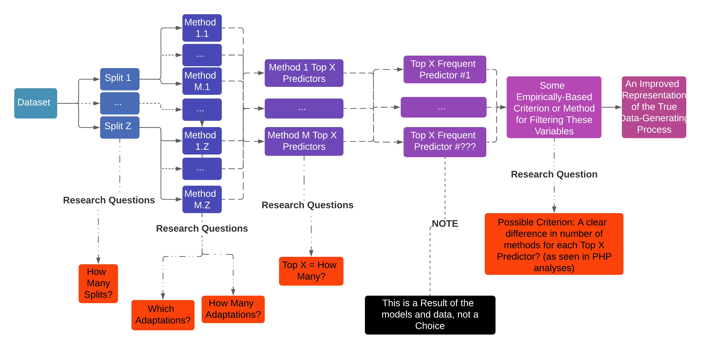
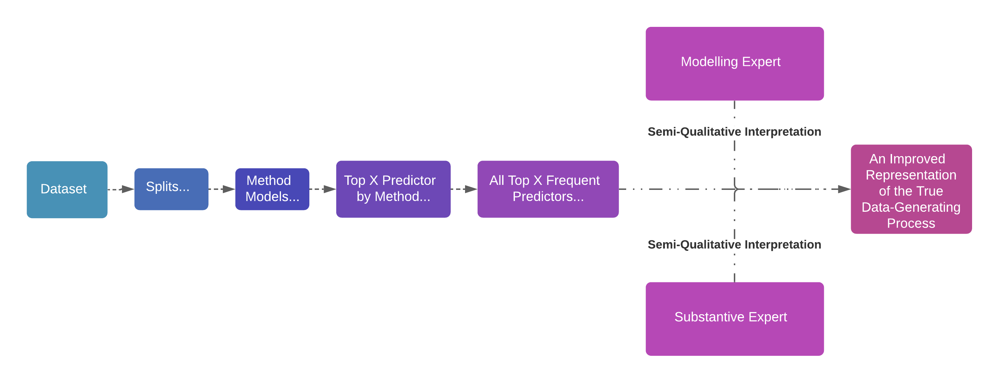

## Introduction

This document combines components described in the various Component_Demos files to implement a combination of lasso and elastic net adaptations for improving variable selection capabilities of these adaptations.

The goal of this walkthrough is to demonstrate the combined approach I propose in the applied chapter of my dissertation (CITE). Over the course of my dissertation, I showed that with non-collinear data, no one lasso or elastic net adaptation dominates others across outlier- and skew-/kurtosis-related scenarios. Some adaptations, like the **multi-step adaptive elastic net**, @XiaoXu2015, perform incredibly well at eliminating variables which were not true predictors of the outcome, even in the presence of extreme outlier contamination. This strong elimination performance unfortunately coincided with a greater tendency to remove true predictors from the model. 

Other methods, including the adaptive LAD (CITE) and adaptive Huber adaptations (CITE) of both the lasso and the elastic net, demonstrated consistently competitive performance in proper inclusion of true predictors and exclusion of non-predictors form a model. However, these adaptations typically did not show superior performance across scenarios relative to other adaptations.

Given these various results, I ultimately proposed a combined approach to implementing the more useful adaptations in a way that leverages their respective strengths. By taking a holistic view of the results across these methods, subjective interpretation can permit us better insight into true predictors of an unknown process.

Much room exists to develop objective and empirical metrics for proper application of such an approach. **Figure 1** below presents the ideal form of this combined approach, given empirically-derived metrics for variable inclusion and exclusion. *Figure 1** also suggests relevant research questions for guiding the development of said objective selection metrics. These questions are indicated below the main diagram in orange boxes. 



**Figure 2**, meanwhile, presents a version of this approach which utilizes subjective interpretation in lieu of objective and empirically-derived metrics and until such metrics are developed. 



The current walkthrough presents a slimmed-down version of the subjective approach. I will not spend too much time on any of the given functions or procedures conducted in the current demontration. I focus primarily on the application and interpretation of combined model approach. Please see the files in the <span style = "color:green">`` `r "Component Demonstrations"` ``</span> section for details on any of the individual components or functions which make up the original

## Preamble and Setup

```{r setup, message = FALSE , warning = FALSE , include=FALSE}
knitr::opts_chunk$set(echo = TRUE , eval = TRUE)
```

### A note on formatting

This document makes use of **bolding**, _italics_, and "quotations" to help distinguish different types of items being referenced.

 * **bolding** will be used when referencing a new term or concept for the first time. Subsequent references to each term/concept will _not_ be bolded.
 * _italics_ will be used primarily for emphasis.
 * 'single quotations' will be used to clarify specific arguments for a function, or specific parameters of a mathemtical/statistical formulation
 * Inline references to code (functions, objects, specific commands, etc.) will use **<span style = "color:blue">`` `r "code_chunk_formatting"` ``</span>** in **<span style = "color:blue">`` `r "bolded blue font"` ``</span>**
 * Inline references to packages will similarly use *<span style = "color:red">`` `r "code_chunk_formatting"` ``</span>*, except in *<span style = "color:red">`` `r "italicized red font"` ``</span>*
 * References to other documents in this repository will use <span style = "color:green">`` `r "code_chunk_formatting"` ``</span> in <span style = "color:green">`` `r "un-italicized, un-bolded, green font"` ``</span>
 
Re: spacing and line breaks - I'm pretty heterogeneous in my application of line breaks and spacing, in a way that is idiosyncratic to my own code practice. The most important aspects of my spacing and line breaks are detailed below.

I generally put spaces between code inputs I consider "sufficiently distinct". This improves readability generally, but I find it particularly helpful for debugging. Note, however, that spaces are generally trivial in between distinct code inputs in R, although this is not universally the case. Multi-character code inputs, such as the pointer **<span style = "color:blue">`` `r "<-"` ``</span>** and most logical operators, _cannot_ include spaces in between components of the code input. Note also that whitespace *is* meaningful in other programming languages, and so this convention should be considered with caution in your own practice.

Generally, I use line breaks to:

 * Break up separate arguments for a single command/function or chain of operations
 * To clearly distinguish between different closing parentheses, brackets, squigglies, etc., since RStudio will automatically tab each closing piece to match its opener.

### Packages

First, let's load the necessary packages. Links to more information about each packages and helpful guides (where applicable) can be found in <span style = "color:green">`` `r "00B_Package_Descr_Refs"` ``</span>. Appropriate references for each package can be found in the "References" section at the end of this document.

```{r libraries , warning = FALSE , message = FALSE}
# This chunk loads the packages used in this workbook
library(xaringan)   # Allows active preview of report in RStudio
library(mvtnorm)    # Generates multivariate-normal data
library(magrittr)   # Used for piping
library(purrr)      # Used for mapping functions efficiently
library(data.table) # For more streamlined data structures
library(glmnet)     # For general lasso/elastic net functionality
library(hqreg)      # For LAD/Huber-loss regularization with SNCD algorithm
library(rlang)      # For parse_expr() to parse data name in k-fold subsetting functions
library(msaenet)      # For the multi-step adaptive elastic net
library(gridExtra)    # For displaying grids of objects
library(grid)         # For creating a title for multiplot grid
library(ggplot2)      # For generating and manipulation graphical objects
```

---
nocite: |
  @magrittr , @purrr , @xaringan , @data.table , @glmnet , @hqreg , @rlang , @msaenet , 
  @gridExtra , @grid , @ggplot2 , @magrittr
---

Note that if you do not have any of the listed packages, you should install them using **<span style = "color:blue">`` `r "install.packages(\"pkg-name-in-quotes-here\")"` ``</span>**.


## Data Generation

To help demonstrate the combined approach in its entirety, I'm going to generate a dataset using an adapted version of my **<span style = "color:blue">`` `r "data_gen()"` ``</span>** function. This time, however, I'm going to generate a dataset with random characteristics which we will not look at until after we've interpreted the results. That way we can mimic a true applied dataset where we do *not* know the true underlying distribution or data-generating mechanism.

To facilitate this, I'm going to make a simple function for randomly generating beta coefficients.

```{r random betas}

```

```{r data-generating function}
data_gen <- function(n , p , eta_x , eta_y , g , h , 
                     seed , tracker) {      
  
  # create a data.table of the conditions of the current dataset
  conditions <- setDT(data.frame(n = n , p = p , 
                                 eta_x = eta_x , eta_y = eta_y , 
                                 g = g , h = h , tracker = tracker , 
                                 seed = seed))

  #create a p-column matrix containing the true coefficients
  betas <- setDT(matrix(0 , nrow = p , ncol = 1))
  betas[1 , 1] <- 0.5
  betas[2,1] <- 1.0
  betas[3,1] <- 1.5
  betas[4,1] <- 2.0
       
  # set seed for random process
  seed <- seed                       
       
  #generate covariance matrix
  covar.X <- matrix(rep(0 , p^2) , ncol = p)  
  # # put 1's along diagonal of covariance matrix
  diag(covar.X) <- 1 
       
  # generate uncontam. X values
  X.UC <- rmvnorm(floor((1 - eta_x)*n) , 
                  mean = rep(0 , p) , 
                  sigma = covar.X)
       
  # generate contaminated X/predictor values or 
  # # g-and-h-based X/predictor values
  if(((g == 0) & (h == 0))){
        # if there is predictor contamination, generate the
        # # contaminated values
        if(eta_x > 0) {                             
                X.C <- rmvnorm(ceiling(eta_x * n) , 
                               mean <- rep(10 , p) , 
                               sigma = covar.X)
                X <- rbind(X.UC , X.C)
        # otherwise, set the uncontaminated values to the
        # # full X dataset
        } else {
                X.C <- 0
                X <- X.UC
        }
              
        #generate uncontom. residuals
        err.UC <- rnorm(floor((1 - eta_y) * n) , mean = 0 , sd = 1)
        if(eta_y > 0) {  
                # if there is response contamination, generate the
                # # contaminated values
                err.C <- rnorm(ceiling(eta_y * n) , mean = 2 , sd = 5)
                err <- c(err.UC , err.C)
              } else {
                # otherwise, set the uncontaminated values to the
                # # final residuals
                err.c <- 0
                err <- err.UC
              }
       } else if(((g != 0) | (h != 0))) {
         # generates X/predictor values from g-and-h distribution
         # # with no outlier contamination
         X <- X.UC
         err <- ghdist(n = n , g = g , h = h)
       }
  
  #generate Y values from X matrix, 
  # # coefficients vector, and residuals vector
  Y <- X %*% betas[ , 1] + err                                    
  
  # Create list of separate components of generated data   
  combine <- list(conditions = conditions ,
                  tracker = tracker , 
                  seed = seed , 
                  betas = betas , 
                  X = setDT(data.frame(X)) , 
                  Y = setDT(data.frame(Y)) , 
                  err = err
                  )        
  
  #save combined list of all generated data
  return(combine)
}
```

```{r generate single dataset}
walkthru.data <- data_gen(n = 100 , p = 200 , 
                          eta_x = sample(x = c(0 , 0.1 , 0.2) , size = 1) , 
                          eta_y = sample(x = c(0 , 0.1 , 0.2) , size = 1) , 
                          g = 0 , h = 0 , 
                          seed = rnorm(1) , tracker = 1
                          )
```

## CV-Splitting data

### K-fold subsetting functions

```{r kfold subsetting function}
# k-fold subsetting function
kfold_subsetter <- function(data , y_col = 1 , 
                            x_cols = c(2:ncol(data)) , 
                            subset_col = (ncol(data) + 1) , 
                            k = 5 , seed = 7 , list = FALSE) {
        # check for string object in data argument
        if(is.character(data)) {
                data <- eval(parse_expr(data))
        }
        
        # check for data.table and setDT() if not a data.table
        if(!(TRUE %in% (class(data) == "data.table"))) {
                data <- setDT(data.frame(data))
        }
        
        # check for 0 < k <= n/2
        if((k <= 0) | (k > (nrow(data) / 2) ) ) {
                stop("ERROR: number of folds 'k' must be greater than 0 and less than or equal to half of the sample size")
        }
        
        # determine number of subsets which contain an extra observation
        # # if n is not evenly divisible by k
        # # # note that this value will be 0 if n/k is evenly divisible
        nsams.large <- nrow(data) %% k
        
        # determine number of smaller subset if n 
        # # is not evenly divisible by k
        # # # note that this will be the total number of samples if 
        # # # # n/k is evenly divisible
        nsams.small <- k - nsams.large
        
        # determine sample size of larger subsets if applicable
        samsize.large <- ceiling(nrow(data) / k) * (nsams.large != 0)
        
        # determine sample size of smaller/all subsets
        samsize.small <- floor(nrow(data) / k)
                
        # create indicator for each subset
        subset.indicator <- c(rep( (1 : k) , 
                                   floor(nrow(data) / k)
                                  ) ,
                              rep( (1 : (nsams.large) ) , 
                                   (1 * (nsams.large != 0) ) 
                                  )
                              )
                
        # fix random assignment process
        if(seed) {
                set.seed(seed)
        }
        
        # combine subset indicator with original data  
        newdata <- cbind(data , 
                         subset = sample(subset.indicator)
                         )
        
        # create k-split list if desired
        if(list == TRUE) {
                newdata <- return(split(newdata , 
                                        newdata[ , "subset"])
                                  )
        } else if(list == "traintest") {
                newdata <- return(list(
                    X = subset(newdata[ , c(x_cols, subset_col) , 
                                            with = F] , subset < k) %>%
                        .[ , c(1:8) , with = F] , #%>% 
                        #as.matrix() , 
                    Y = subset(newdata[ , c(y_col , subset_col) , 
                                        with = F] , subset < k) %>%
                        .[ , 1 , with = F] , #%>%
                        #as.matrix() , 
                    X_Test = subset(newdata[ , c(x_cols, subset_col) , 
                                            with = F] , subset %in% k) %>%
                        .[ , c(1:8) , with = F] , # %>%
                        #as.matrix() , 
                    Y_Test = subset(newdata[ , c(y_col , subset_col) , 
                                        with = F] , subset %in% k) %>%
                        .[ , 1 , with = F] , # %>%
                        #as.matrix() , 
                    Seed = seed , 
                    Subsets = newdata[ , "subset"]
                    )
                    )
        } else {
                newdata <- return(newdata)
        }
}


```

```{r multi-kfold wrapper}
kfold_multi <- function(data , ... , seed_multi = 713 , 
                        num_splits = 100 , test_percent = .2) {
        # set the seed for generating individual kfold seeds
        set.seed(seed_multi)
        
        # turn data object name into character string for subsequent use
        data.name <- deparse(substitute(data))
        
        # generate random numbers equal to num_splits so that each
        # # individual run of the subsetter has a unique seed
        seeds <- sample(c(1:100000) , size = num_splits , replace = FALSE)
        
        # set value of k corresponding with test_percent
        if((test_percent >= 1) | (test_percent <= 0)) {
                stop("ERROR: 'test_percent' must be greater than and less than 1")
        }
        
        # set k for individual splits
        k <- 1 / test_percent
        
        # initialize and data.table of kfold arguments
        split_repped.dt <- setDT(as.data.frame(matrix(ncol = 1 , 
                                              nrow = num_splits)))
        
        # fill data.table with arguments for kfold function
        split_repped.dt[ , ':=' (data = data.name , 
                         k = k , 
                         seed = seeds , 
                         list = "traintest"
                         )
                 ]
        
        # remove blank column from initializing
        split_repped.dt <- split_repped.dt[ , !1 , with = F]
        
        # run subsetter for the desired number of splits
        full.data <- split_repped.dt %>%
                pmap(kfold_subsetter)
        
        # store single object of all training/testing splits
        return(full.data)
}
```

### Create cv-split data

```{r create cv-split data 10 splits}
wtcv.10 <- kfold_multi(data = walkthru.data , num_splits = 10)
```

```{r create cv-split data 100 splits}
wtcv.100 <- kfold_multi(data = walkthru.data , num_splits = 100)
```

```{r create cv-split data 250 splits}
wtcv.250 <- kfold_multi(data = walkthru.data , num_splits = 250)
```

